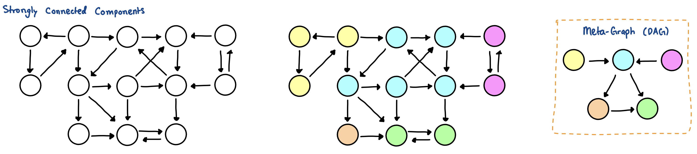
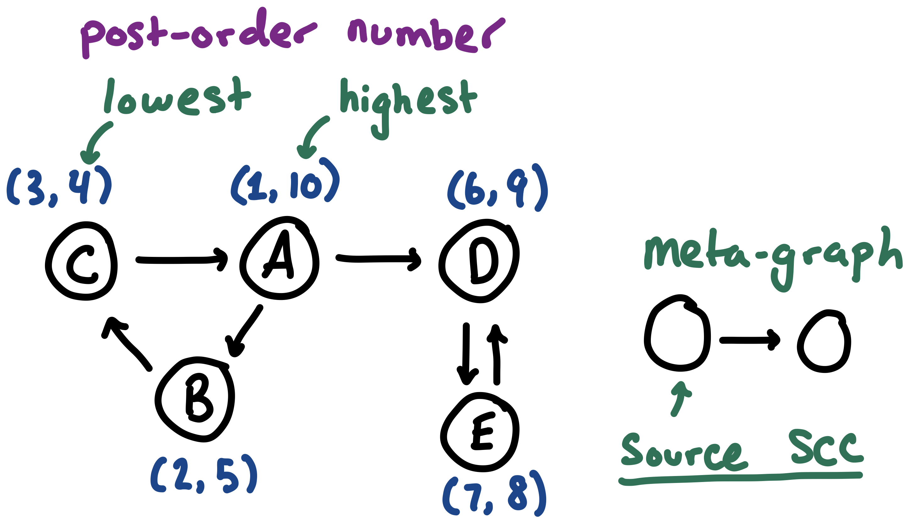

## Advanced Graphs

### Strongly Connected Components (SCCs)
In a directed graph, a **Strongly Connected Component (SCC)** is a maximal subset of vertices where every vertex can reach every other vertex.
- If we compress every SCC into a single "meta-node," the resulting graph is strictly a **Directed Acyclic Graph (DAG)**. This allows us to run [DP](dynamic-programming.md) on cyclic directed graphs by first compressing them.



**Keywords:**
- Source node: a node with in-degree = 0.
- Sink node: a node with out-degree = 0.
- Source/Sink SCC: a SCC that is a source/sink in the meta-graph representation.

**Kosaraju's Algorithm**
1. Run a standard DFS on the graph and record the "exit time" (post-order) of every node.
    - The node that finishes last must belong to a "source" SCC.
2. Reverse all the edges in the graph.
    - This will convert the "source" SCC into a "sink" SCC.
    - If we run a DFS on a "sink" SCC, we can explore as much as possible without worrying about leaving the SCC. We can retrieve all nodes that are a part of a given "sink" SCC this way.
3. Run DFS again, processing unvisited nodes strictly in decreasing order of their exit times.
    - This processing order is equivalent to a [topological order](graph-traversals.md) of the graph.
    - All nodes that are reachable will be a part of the same/current strongly connected component.

**Proof:**
- If $C_1$ and $C_2$ are two SCCs, and there is an edge $C_1 \to C_2$, the highest post number in $C_1$ is bigger than any in $C_2$.
    - Case 1: DFS reaches $C_1$ first, then it will have to traverse through all of $C_2$ before removing the node in $C_1$ from the call-stack.
    - Case 2: DFS reaches $C_2$ first, we won't be reaching $C_1$ while any node within $C_2$ is still on the call-stack because there is only an edge $C_1 \to C_2$ and not the other way. If there existed an edge $C_2 \to C_1$, then this would be one combined SCC, but this is not our claim. So $C_2$ finishes, then we start pre-numbers in $C_1$ and end with post-numbers in $C_1$.

> **Note:** the node with the highest post-order number is always in a source SCC, but the node with the lowest post-order number is **not necessarily** in a sink SCC.



**Time Complexity:** $O(V + E)$

```cpp
const int mxn = 2e5 + 5;
std::vector<int> adj[mxn], rev_adj[mxn];
bool seen[mxn];

std::vector<int> order, component;
int scc_id[mxn]; 
int current_scc = 0;

void dfs1(int u) {
  seen[u] = true;
  for (int v: adj[u]) {
    if (!seen[v]) dfs1(v);
  }
  order.push_back(u); // record post-order
}

void dfs2(int u) {
  seen[u] = true;
  component.push_back(u);
  scc_id[u] = current_scc;
  for (int v: rev_adj[u]) {
    if (!seen[v]) dfs2(v);
  }
}

void find_sccs(int n) {
  std::fill(seen, seen+n+1, false);
  for (int i = 1; i <= n; i++) {
    if (!seen[i]) dfs1(i);
  }

  std::fill(seen, seen+n+1, false);
  std::reverse(order.begin(), order.end());
  for (int u: order) {
    if (!seen[u]) {
      current_scc++;
      component.clear();
      dfs2(u);
      // 'component' holds all nodes in this SCC
    }
  }
}
```

### 2-SAT (2-Satisfiability)
2-SAT problems ask if there is a valid boolean assignment to $N$ variables given a set of constraints in the form $(A \lor B)$.
- **Intuition:** The clause $(A \lor B)$ is logically equivalent to $(\neg A \to B) \land (\neg B \to A)$.
    - We can build an **Implication Graph** where nodes represent variables and their negations.
    - A directed edge $U \to V$ means "If $U$ is true, $V$ must be true."

**Algorithm:**
1. Build a graph with $2N$ nodes ($x$ and $\neg x$).
2. For each condition $(A \lor B)$, add edges $\neg A \to B$ and $\neg B \to A$.
3. Find all SCCs.
4. **Validation:** If $x$ and $\neg x$ end up in the exact same SCC, the conditions are contradictory, and no valid assignment exists.
5. **Assignment:** If valid, for every variable $x$, assign it `true` if `scc_id[x] > scc_id[!x]`, otherwise `false`.
    - Kosaraju's naturally assigns SCC IDs in reverse topological order.

### Bridges and Articulation Points

- **Bridge:** An edge whose removal increases the number of connected components.
- **Articulation Point:** A node whose removal increases the number of connected components.

**Intuition:** We use a DFS tree. We maintain a `tin[u]` (time of entry) and `low[u]` (the lowest `tin` reachable from $u$ using at most one back-edge).
- If `low[v] > tin[u]`, it means there is no way to reach the ancestors of $u$ from $v$ without using the edge $u \to v$. Thus, $u \to v$ is a strict bridge.

**Time Complexity:** $O(V + E)$

```cpp
int timer;
int tin[mxn], low[mxn];
bool seen[mxn];
std::vector<std::pair<int, int>> bridges;

void dfs_bridges(int u, int p = -1) {
  seen[u] = true;
  tin[u] = low[u] = timer++;

  for (int v: adj[u]) {
    if (v == p) continue;
    if (seen[v]) {
      low[u] = std::min(low[u], tin[v]); // back-edge
    } else {
      dfs_bridges(v, u);
      low[u] = std::min(low[u], low[v]);

      if (low[v] > tin[u]) {
        bridges.emplace_back(u, v);
      }
    }
  }
}
```

### Complete Paths (Eulerian Circuits)
- **Eulerian Path:** A path that visits every **edge** exactly once.
- **Eulerian Circuit:** An Eulerian path that starts and ends on the same node.

> **Note:** Visiting every **node** exactly once is a Hamiltonian Path, which is NP-Hard and typically solved via Bitmask DP in $O(N^2 2^N)$ rather than graph logic.

**Graph Requirements:**
- **Undirected Circuit:** All vertices must have an even degree.
- **Undirected Path:** Exactly zero or two vertices have an odd degree.
- **Directed Circuit:** `in_degree[u] == out_degree[u]` for all nodes.
- **Directed Path:** At most one node has `out_degree - in_degree == 1`, at most one has `in_degree - out_degree == 1`, and all others are equal.

**Hierholzer's Algorithm** -- identifying Eulerian circuit in $O(E)$ time.
- Do a DFS, removing edges as you traverse them.
- Once a node has no outgoing edges left, push it to a stack.
- The final path is the stack popped in reverse.

```cpp
std::vector<int> euler_path;
int edge_idx[mxn]; // keep track of deleted edges to maintain O(E)
void hierholzer(int u) {
  while (edge_idx[u] < adj[u].size()) {
    int v = adj[u][edge_idx[u]++];
    hierholzer(v);
  }
  euler_path.push_back(u);
}
// reverse euler_path after the function finishes.
```

### Network Max Flow (Dinic's Algorithm)

Strongly polynomial maximum flow algorithm with a runtime of $O(V^2 E)$.
- *The algorithm's time complexity does **not** depend on the capacity of nodes.*
- We can also use Dinic's algorithm to solve **Bipartite Matching** in $O(E \sqrt{V})$ (by creating a dummy $S$ and $T$).

> Max flow asks for the maximum amount of "water" that can be routed from a source node $S$ to a sink node $T$ through a network of pipes with strict capacities.
> By the **Max-Flow Min-Cut Theorem**, the maximum flow is identical to the minimum capacity of edges you must remove to completely disconnect $S$ from $T$.

**Properties of a Valid Flow:**
- A flow network is a directed graph where every edge $e$ has a current flow $F_e$ and a maximum capacity $C_e$.
- A valid flow must obey the following constraints:
    1. **Capacity Constraint:** The flow through an edge cannot exceed its capacity, and cannot be negative: $0 \le F_e \le C_e$ for all $e \in E$
    2. **Flow Conservation:** For all nodes $u$ (except $s$ and $t$), the total amount of flow entering $u$ must equal the total amount leaving: $\sum_{(w, u) \in E} F_{(w, u)} = \sum_{(u, z) \in E} F_{(u, z)}$
    3. **Value of the Flow ($|f|$):** The total flow of the entire network is simply the net flow leaving the source $s$, which is guaranteed to equal the net flow entering the sink $t$.

**Network Flow Keywords and Definitions:**
- **Remaining Capacity:** For any edge (*residual* or not), its remaining flow capacity is: $C_e - F_e$.
- **Residual (Reverse) Edge:** If we push $X$ units of flow along an edge $U \to V$, we artificially create a "reverse" edge $V \to U$ with a capacity of $X$.
    - These are *derived* edges that aren't a part of the presented network.
    - They are used as an "undo" mechanism for bad augmenting paths that don't lead to a maximum flow. The flow can now always flow backwards if a better path may exist.
    - They have a capacity of zero, and a flow equal to $-1 \times \text{forward\_edge}$ flow.
        - Since all forward edge flows are initially zero, residual edges start as `0/0`.
    - **Property:** `remaining_capacity(u -> v) + remaining_capacity(v -> u residual) = capacity(u -> v)`
- **Saturated Edge:** an edge with a remaining capacity of zero.
- **Residual Graph ($G_f$):** Graph of the presented network, with the addition of all residual edges.
- **Augmenting Path:** Path of unsaturated edges in the *residual graph* from $s$ to $t$.
* **Bottleneck Value ($\Delta$):** The smallest *remaining capacity* of all edges in a given *augmenting path*.
* **How to Augment a Path:** 
    1. For every original "forward" edge on the path, increase its flow by the bottleneck: $F_e = F_e + \Delta$.
    2. For every artificial "reverse" edge on the path, decrease the flow of its corresponding original edge: $F_{\text{original}} = F_{\text{original}} - \Delta$.
        - This should maintain the remaining capacity summation property between each forward and residual edge.

> **Implementation Note:** we store forward and reverse edges adjacently (e.g., indices `0` and `1`, `2` and `3`). We update the reverse edge using bitwise XOR: `id ^ 1`.
  - Adding flow to `edges[id]` and subtracting from `edges[id ^ 1]` maintains the residual state.

**Dinic-Specific Vocabulary:**
- **Level Graph:** Restricted version of the residual graph created via BFS.
    - Every node is assigned a "level": shortest distance from $s$ **obeying remaining capacity values**.
    - Deletes all edges that go backward or stay on the same level. Edges are only valid if they go exactly from level $k$ to $k+1$.
- **Blocking Flow:** Determines the stopping point during the DFS iterations.
    - A flow is blocking when *every possible path* from $s$ to $t$ in the level graph contains at least one *saturated edge*.
    - Once a blocking flow is found, BFS must run again to reconstruct the level graph.

**Algorithm:**
1. Construct a level graph by doing a BFS from the source $s$ on the current residual graph (obeying remaining capacities).
2. If the sink node $t$ was never reached while building the level graph, stop and return the max flow.
3. Using only valid edges in the level graph (edges that go exactly from level $k$ to $k+1$), do multiple DFSs from $s \to t$ until a *blocking flow* is reached.
    - Augment each path that is discovered (updating forward and residual edges).
    - **Dead-End Pruning (`ptr` array):** If a DFS explores a node and finds no valid path to $t$, mark that node's outgoing edges as "exhausted." Do not explore them again during the current level graph phase.
4. Repeat from Step 1 until the algorithm terminates at Step 2.

```cpp
struct FlowEdge {
  int v, u;
  long long cap, flow = 0;
  FlowEdge(int v, int u, long long cap) : v(v), u(u), cap(cap) {}
};

std::vector<FlowEdge> edges;
std::vector<int> adj_flow[mxn];
int level[mxn], ptr[mxn];

// add both the forward and residual edge to the graph
void add_flow_edge(int u, int v, long long cap) {
  adj_flow[u].push_back(edges.size());
  edges.emplace_back(u, v, cap);
  adj_flow[v].push_back(edges.size());
  edges.emplace_back(v, u, 0); // residual
}

bool bfs_level(int s, int t, int n) {
  std::fill(level, level+n+1, -1);
  level[s] = 0;
  std::queue<int> q;
  q.push(s);
  while (!q.empty()) {
    int u = q.front(); q.pop();
    for (int id: adj_flow[u]) {
      if (edges[id].cap - edges[id].flow < 1) continue;
      if (level[edges[id].v] != -1) continue;
      level[edges[id].v] = level[u] + 1;
      q.push(edges[id].v);
    }
  }
  return level[t] != -1;
}

long long dfs_flow(int u, int t, long long pushed) {
  if (pushed == 0) return 0;
  if (u == t) return pushed;
  // try each node as the next neighbor for a dfs traversal (will ptr track the next neighbor to attempt for a given node in the dfs)
  for (int& cid = ptr[u]; cid < (int)adj_flow[u].size(); ++cid) {
    int id = adj_flow[u][cid];
    int v = edges[id].v;
    long long rem_cap = edges[id].cap - edges[id].flow;

    if (level[u]+1 != level[v] || rem_cap == 0) continue;

    // push the bottlenecked amount through this node
    long long push = dfs_flow(v, t, std::min(pushed, rem_cap));
    if (push == 0) continue;

    // augment:
    edges[id].flow += push;
    edges[id ^ 1].flow -= push;
    return push;
  }
  return 0;
}

long long dinic(int s, int t, int n) {
  long long flow = 0;
  while (bfs_level(s, t, n)) {
    std::fill(ptr, ptr+n+1, 0);
    while (long long pushed = dfs_flow(s, t, 1e18)) {
      flow += pushed;
    }
  }
  return flow;
}
```

### Resources
- max-flow: https://www.youtube.com/watch?v=M6cm8UeeziI&list=PLDV1Zeh2NRsDj3NzHbbFIC58etjZhiGcG&index=11
