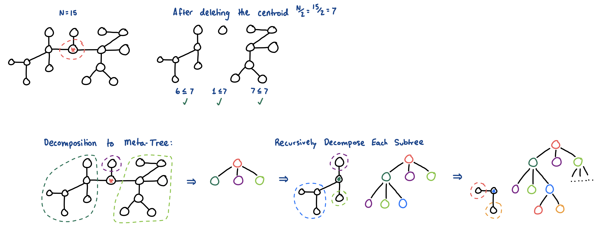
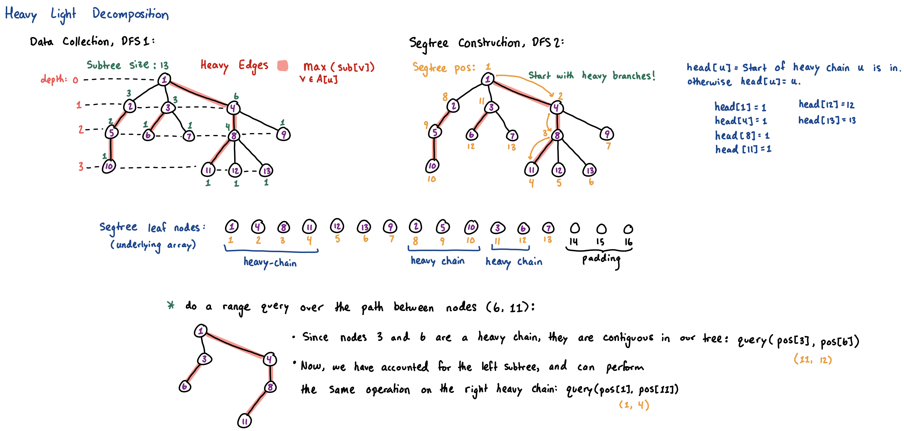

> When a problem asks you to update edge weights along a path, or count the number of paths satisfying a complex condition across an entire tree, standard $O(N)$ traversals may be too slow. We must **decompose** the tree into structures that allow for $O(\log N)$ or $O(\log^2 N)$ operations.

## Centroid Decomposition
Divide-and-conquer technique for trees, primarily used when a problem asks you to calculate something over **all possible paths** in a tree (e.g., "Find the number of paths with a total weight of exactly $K$").

- **Centroid:** A node such that if you remove it, no resulting connected component (subtree) has more than $N/2$ nodes.
- The **centroid decomposition** of a tree is another tree defined recursively as:
    - Its root is the centroid of the original tree.
    - Its children are the centroid of each tree resulting from the removal of the centroid from the original tree.



**Implementation:** counting subtree sizes, finding the centroid, recursively building the decomposition.
- Note that every tree will have **at least one** centroid.
- We can pick an arbitrary node $a$:
    - If all of its subtrees have a size $\leq N/2$, then this is a centroid.
    - Otherwise, we can simply pick any node in the subtree with $> N/2$ nodes, and try again.
```cpp
const int mxn = 2e5 + 5;
std::vector<int> adj[mxn];

int n; // total nodes
bool is_centroid[mxn];
int subtree_size[mxn];
int centroid_parent[mxn]; // stores the structure of the Centroid "Meta"-Tree

// 1. get subtree sizes
int dfs(int u, int p) {
  subtree_size[u] = 1;
  for (int v: adj[u]) {
    if (v != p && !is_centroid[v]) {
      subtree_size[u] += dfs(v, u);
    }
  }
  return subtree_size[u];
}

// 2. go into subtrees of > N/2 until finding a centroid
int get_centroid(int u, int p) {
  for (int v: adj[u]) {
    if (v != p && !is_centroid[v] && subtree_size[v] > n/2) {
      return get_centroid(v, u);
    }
  }
  return u;
}

// 3. build the decomposition recursively
void build_centroid_tree(int u, int p = 0) {
  n = dfs(u, 0); // total nodes
  int centroid = get_centroid(u, 0);

  centroid_parent[centroid] = p;
  is_centroid[centroid] = true;
  for (int v: adj[centroid]) {
    if (!is_centroid[v]) {
      build_centroid_tree(v, centroid);
    }
  }
}
```

## Heavy-Light Decomposition (HLD)
- HLD is used when you need to perform range queries or updates (like max, min, or sum) on the path between any two nodes $u$ and $v$ in a tree.
- **Intuition:** We already know how to do range queries on 1D arrays efficiently using a [segment tree](segment-tree.md) or [binary index tree](fenwick-tree.md), but tree nodes are not contiguous in memory.
    - HLD solves this by splitting the tree's edges into two categories.
    - An edge $(u, v)$ can be a:
        1. **Heavy Edge:** The edge leading to the child with the **largest** subtree (`max_sub`). Every non-leaf node has exactly one heavy edge.
        2. **Light Edge:** All other edges.

Each group of connected heavy edges will form **disjoint (starting/ending at different nodes), straight (non-branching) paths** down the tree.
- We can map these heavy chains into a contiguous segment in our segment tree.
    - The path between *any* two nodes in the tree will traverse **at most $O(\log N)$ light edges**.
    - This means a path query will be broken into $O(\log N)$ standard segement tree queries.

> **Note:** we could also implement the query operations with a fenwick tree, but the segment tree is a little simpler to visualize.

* **Time Complexity:** $O(\log^2 N)$ per path query.
* **Implementation:** two distinct DFS passes:
    * Calculate subtree sizes and the find the heavy child.
    * Define the chains and map to a segment tree index (`pos[u]`).
```cpp
int parent[mxn], depth[mxn], head[mxn];
int heavy[mxn]; // heavy child of node u
int pos[mxn];   // index of node u in the segment tree
int current_pos = 0;

// Sizes, depths, parents, and heavy children
int dfs1(int u, int p = 0) {
  int size = 1;
  int max_sub = 0;
  parent[u] = p;
  heavy[u] = 0; // 0 indicates no heavy child (leaf)

  for (int v: adj[u]) {
    if (v != p) {
      depth[v] = depth[u] + 1;
      int sub_size = dfs1(v, u);
      size += sub_size;
      if (sub_size > max_sub) {
        max_sub = sub_size;
        heavy[u] = v;
      }
    }
  }
  return size;
}

// Build the chains and assign segment tree positions
void dfs2(int u, int h) {
  head[u] = h; // 'h' is the highest node in the current heavy chain
  pos[u] = ++current_pos;

  // always traverse the heavy child first to keep the chain contiguous in memory
  if (heavy[u] != 0) {
    dfs2(heavy[u], h);
  }

  for (int v: adj[u]) {
    if (v != parent[u] && v != heavy[u]) {
      dfs2(v, v); // start a new heavy chain where 'v' is the head
    }
  }
}

// depth[1] = 0;
// dfs1(1, 0);
// dfs2(1, 1);
```

**Path Queries using HLD -- Utilizing the Decomposition**
- To query the path between $u$ and $v$, we compare the heads of their respective chains.
- Take the node whose chain head is strictly deeper, query that contiguous chunk in our segment tree (from `pos[head[u]]` to `pos[u]`), and jump up to the parent of the chain (`parent[head[u]]`).
    - We repeat this until $u$ and $v$ are on the exact same chain.

> **Note:** this is assuming that the "weight" or contribution factor is associated to each *node*. If we are doing a range query on values associated to *edges*, this will have to be modified.
> This is apparent due to the transition between each heavy-chain, where we skip the edge via: `u = parent[head[u]]`.



```cpp
long long query_path(int u, int v) {
  long long res = 0; // identity value in segment tree (INF for min-queries)
  while (head[u] != head[v]) {
    if (depth[head[u]] < depth[head[v]]) {
      std::swap(u, v);
    }

    // query the contiguous heavy chain in segtree
    res += query(pos[head[u]], pos[u]);
    u = parent[head[u]]; // jump to the parent of the chain we used up
  }

  // now they are on the same chain, query the remaining segment
  if (depth[u] > depth[v]) {
    std::swap(u, v);
  }
  res += query(pos[u], pos[v]);
  return res;
}
```

**Similarities to [Binary Lifting/LCA](trees.md)**
- Both algorithms solve the exact same core problem: Finding a fast way to traverse the path between two arbitrary nodes $u$ and $v$ by taking "shortcuts" up the tree.
- **Binary Lifting (LCA):** Takes shortcuts in powers of $2$. It aligns the nodes by depth, then jumps them up in tandem until they converge.
- **HLD:** Takes shortcuts via Heavy Chains. It aligns the nodes by chain head, continuously jumping the node with the deeper chain `head` up to `parent[head]`, until both nodes land on the exact same chain.
    - Once $u$ and $v$ are on the same heavy chain in HLD, the node that is higher up (has the smaller depth) is guaranteed to be the Lowest Common Ancestor!

**Time Complexity:** $O(\log N)$. Often requiring fewer jumps and thus a smaller constant factor than binary lifting.

```cpp
int get_lca_hld(int u, int v) {
  // jump chains until u and v are on the same chain
  while (head[u] != head[v]) {
    if (depth[head[u]] < depth[head[v]]) {
      std::swap(u, v);
    }
    u = parent[head[u]]; // jump the deeper one up
  }
  // they are on the same chain. The shallower node is the LCA.
  return depth[u] < depth[v] ? u : v;
}
```

### Resources
- Centroid: https://medium.com/carpanese/an-illustrated-introduction-to-centroid-decomposition-8c1989d53308
