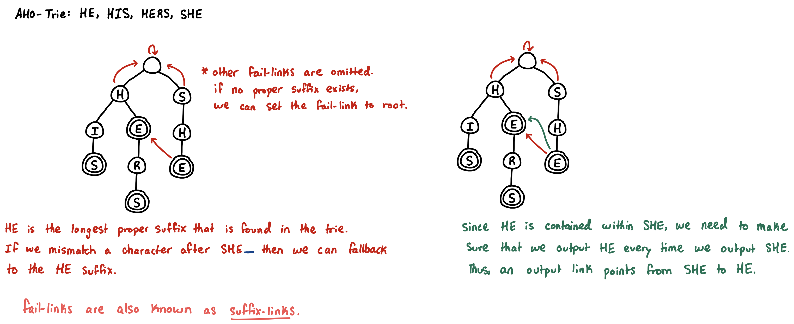

## Aho-Corasick Algorithm

> **TL;DR:** If KMP is a 1D state machine for finding **one** pattern, Aho-Corasick is a Trie-based state machine for finding **multiple** patterns simultaneously. It operates in $O(N + M + Z)$ time, where $N$ is the text length, $M$ is the sum of all pattern lengths, and $Z$ is the number of matches.

### KMP on a Trie
- Instead of building a state machine from a single string, we insert all our target patterns into a [Standard Trie](trie-prefix-tree.md) and include additional links/edges.
- Every node in the Trie represents a state (a specific prefix of one or more patterns).
- Just like [KMP](prefix-function-kmp.md) uses the `LPS` array to fall back when a character mismatches (or we identify a full pattern-match), Aho-Corasick uses **Failure Links** to jump between branches of the Trie when a character mismatches.

**Failure Links (also known as Suffix Links)**
* **KMP:** `lps[i]` points to the longest proper prefix of the pattern that is also a suffix.
* **Aho-Corasick:** For any node $U$, its `fail` (`suffix`) link points to node $V$, where the string represented by $V$ is the **longest proper *suffix*** of $U$ that *exists in the Trie*.
    * If we mismatch a character after traversing down a particular branch, and a suffix of the current path exists in the trie, we can jump there and resume our search, as if we are omitting one or more leading characters from our original traversal.
    * In the example below, `S-H-E` will link to the bottom node of `H-E`, dropping 1 leading character.

**Output Links**
* Since one pattern might be entirely contained within another, such as `HE` within `SHE`, we need to account for tracking both occurrences.
* When we visit a node, we can look for any output links that represent another sub-pattern that has been discovered despite travelling along a different branch path.
* Output links form a **chain** such that a single node only ever requires one output link. For example, `SHE` links to `HE` which links to `E` (assuming that we also inserted `E` into the trie, which is not pictured in the image below).



> **The key idea of the Aho-Corasick algorithm** is the claim that we can perform the multiple pattern matching algorithm by simply identifying all fail-links and output-links, traversing through the trie using the `text` string, obeying the output links to recognize where some `pattern`(s) appear within `text`, and taking a fail-link whenever there is no transition from the current vertex using the current letter.

**We have now reduced the multiple pattern matching algorithm into the problem of constructing output and failure links**

### Constructing Output and Failure Links
* Standard Aho-Corasick implementation:
    * During the search phase, if you read a character and the current node doesn't have an edge for it, you have to use a KMP-style while loop to manually walk up the fail-links until you find a node that does have that edge for the current character.
* **DFA Optimization:** during the [BFS](graph-traversals.md) build phase, if a node is missing a child edge for a specific character, we simply assign the edge intended for the character to route to wherever the fail-link-node would route us for that character. This means that the trie's **search** implementation doesn't have to consider the fail-links at all.

```cpp
// mxNodes must be >= the sum of the lengths of all strings inserted
const int mxNodes = 1e5 + 5;
int tree[mxNodes][26];
int fail[mxNodes]; // KMP fallback state
int term[mxNodes]; // compresses 'is_end' and 'out_link' into one
int pid[mxNodes];
int cnt = 0; // next available unused node index

void insert(const std::string& s, int id) {
  int u = 0;
  for (char c : s) {
    int v = c - 'a';
    if (!tree[u][v]) tree[u][v] = ++cnt;
    u = tree[u][v];
  }
  term[u] = u; // mark this state as the end of a valid word
  pid[u] = id;
}

// build fail-links and dfa
void build() {
  std::vector<int> que(cnt + 1); // array-based queue
  int start = 0, finish = 0;
  que[finish++] = 0;
  while (start < finish) {
    int u = que[start++];
    int fallback = fail[u];

    // if 'u' isn't a word, adopt the word-status of its fallback
    if (!term[u]) term[u] = term[fallback];

    for (int v = 0; v < 26; ++v) {
      if (tree[u][v]) {
        // root's children explicitly fall back to 0.
        fail[tree[u][v]] = (u == 0) ? 0 : tree[fallback][v];
        que[finish++] = tree[u][v];
      } else {
        // optimization: wire missing edges directly to the fallback's destination
        tree[u][v] = tree[fallback][v];
      }
    }
  }
}

// standard trie search
void search(const std::string& text) {
  int u = 0, n = (int)text.size();
  for (int i = 0; i < n; ++i) {
    int v = text[i] - 'a';
    u = tree[u][v];
    int match_state = term[u]; // retrieve all overlapping output links
    while (match_state != 0) {
      // found pid[match_state] ending at text index i
        std::cout << pid[match_state] << " ending at " << i << "\n";
      match_state = term[fail[match_state]];
    }
  }
}
```

### Resources
* https://cp-algorithms.com/string/aho_corasick.html
* blog: https://codeforces.com/blog/entry/14854
* visual: https://www.youtube.com/watch?v=XWujo7KQL54
