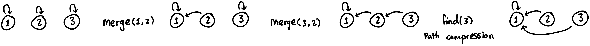

## Disjoint Set Union (DSU)

> **TL;DR:** Tracks connected components in a forest/graph and allows fast merging of sets/subtrees.

### Structure



* Allows for fast query and updates: $O(\alpha (N))$, which is the **inverse Ackermann**, practically constant $O(1)$ time.

* We initally represent each element as its own tree.
* Each node points to a "parent".
* The root of each tree is the "representative" of that particular component.
  - When we query for what group a given node is on, we return whatever the topmost parent node is.

- **Optimizations:**
  1. **Path Compression:** When you walk up the tree to find the root, redirect every node on that path to point directly to the root. This flattens the tree dynamically.
  2. **Union by Size:** When merging two roots, always attach the smaller tree to the root of the larger tree. This guarantees the tree depth never exceeds $\log N$.

* **Usage:** this data structure is used to create the forest in [Kruskals MST algorithm](kruskals.md).

### Implementation

```cpp
const int mxn = 2e5 + 5;
int parent[mxn];
int sz[mxn];
void init(int n) {
  std::iota(parent, parent+n, 0);
  std::fill(sz, sz+n, 1);
}
int find(int u) {
  if (u == parent[u]) return u;
  return parent[u] = find(parent[u]);
}
bool merge(int u, int v) {
  u = find(u), v = find(v);
  if (u == v) return false;
  if (sz[u] < sz[v]) std::swap(u, v);
  parent[v] = u;
  sz[u] += sz[v];
  return true;
}
```
