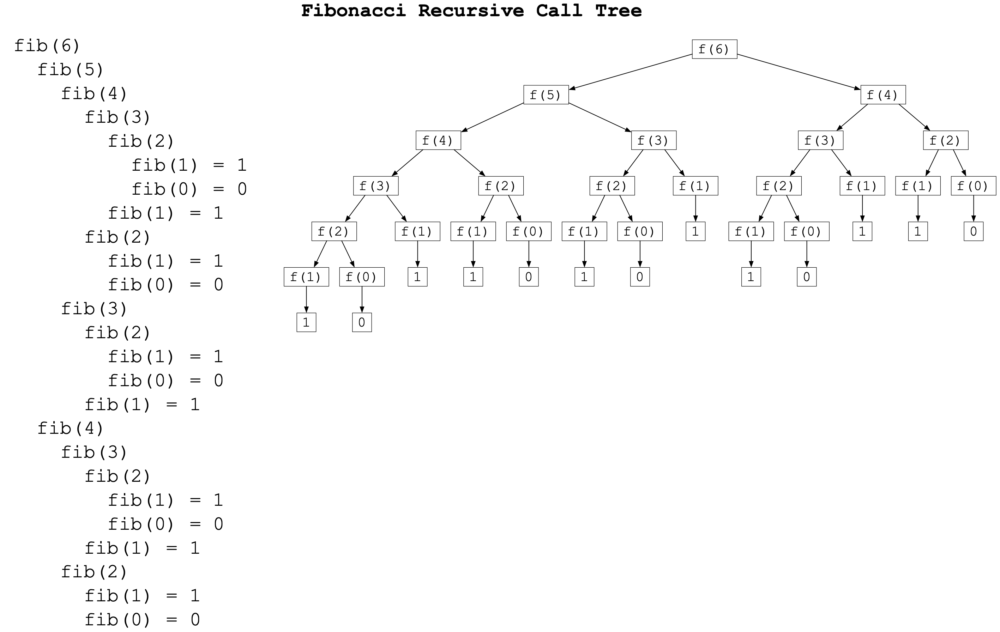
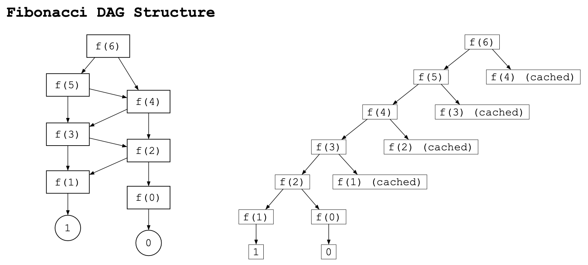

## Dynamic Programming Fundamentals

Dynamic Programming (DP) is an optimization technique for **recursive problems**.
- A recursive tree often includes a lot of unecessary recomputation.
    - Divide and conquer partitions a problem into *disjoint* subproblems.
    - DP applies when the subproblems *overlap* with one another.
- A DP solution will *cache* the answer to a given state (recursive call), so that we only have to compute it once.
    - Subsequent recursive calls that utilize parameters that we have already solved for will now be accessible in $O(1)$ time.

### Example: Fibonacci Recurrence
The fibonacci recurrence is defined as:
$$
f(n)=
\begin{cases}
0 & \text{if } n = 0, \\
1 & \text{if } n = 1, \\
f(n-1) + f(n-2) & \text{otherwise}.
\end{cases}
$$

This can written intuitively as a recursive function as follows:
```scheme
(define (fib n)
  (cond ((= n 0) 0)
        ((= n 1) 1)
        (else (+ (fib (- n 1)) (fib (- n 2))))))
```
```cpp
int fib(int n) {
  if (n <= 1) return n;
  return fib(n - 1) + fib(n - 2);
}
```



> **It is important to note that a recurrence relation is NOT the same as a recursive function.**
- It is not a task or procedure, it simply is a mathematical equation/definition that has no side-effects or further computations.
- Recursive terms are *values*, not tasks that need to be performed.
- Because of this, we can simplify the relationship between the different values that we need to compute in the recurrence relation.
    - The [**DAG** structure](graph-traversals.md) is much more simplified! This is because a mathematical value for $f(6)$ will always be a constant number, there is no need to have multiple nodes representing this "computation". These terms are **values**, not new tasks!
    - We can also note that there is a **clear order of dependencies** when representing the recurrence relation in a DAG form.
        - We must compute the recurrence terms/values in the correct order!



### Dynamic Programming Summary
- **Requirements:**
    - Must have a recurrence relation.
        -  Function must be pure: no side effects.
    - Recurrence relation < Recursive Execution.
- **Time Complexity:**
    - `(# Unique States) * (Cached Complexity)`
        - `# Unique States`:
            - Size of recurrence relation.
            - Usually the product of parameter bounds.
        - `Cached Complexity`:
            - What is the time complexity of the function assuming recursive calls are $O(1)$?
- **Main Ideas:**
    - Recurrence relation != Recursive execution
    - A recurrence relation is a mathematical construct:
        - No side effects.
        - No addded "computation".
        - Does not require recursive execution.
        - Just a relationship between states/values.
    - DP simply decomposes problems with recurrence relations by calculating recursive terms *a single time*, evaluating all terms in a valid order of dependencies.


### Implementation Decisions
**Recursive (Top-Down Memoization)**
- If we can define the recurrence relation to a problem, the recursive approach is very straightforward.
    - We can simply use a map to track the value for a given set of parameters that are involved in the recurrence relation, after the first time we compute them. In python we can use the `@cache` decorator.
```cpp
int dp[mxn+1];
std::fill(dp, dp+mxn+1, -1);
int fib(int n) {
  if (n <= 1) return n;
  if (dp[n] != -1) return dp[n];
  return dp[n] = fib(n - 1) + fib(n - 2);
}
```

> The issue with this recursive approach is that it can be a lot slower than an iterative approach due to function call overhead and poor cache locality, despite having the same time complexities.

**Iterative (Bottom-Up Tabulation)**
- An iterative approach avoids the added overhead from recursion and is often faster due to cache locality.
- The transition from a recursive solution to an iterative solution can be very mechanical, so it is common to start with the recursive solution to first prove correctness.

1. **Define the range of valid bounds on each parameter.**
    - Base cases and starting arguments are the "endpoints".
    - An n-dimensional (number of parameters) array can be used to store each value in the recurrence state.
        - 1-based indexing is often used to protect against negative index bounds.
    - Otherwise, a builtin map tool can be used, which will work with negative values/indexing.
2. **Determine the order in which each parameter must be solved in.**
    - When we use recursion, we give a stack frame and our terms are calculated in the correct order. In iteration, we need to handle that order ourselves.
    - The general term (current parameters) **depends on** its recursive terms (call args). Recursive terms must be calculated **before** the general term.
        - `"ans[i] = f(i + 1)"`: the answer for $i$ depends on the answer for $i+1$, thus we need to solve *big before small*.
        - `"ans[i] = f(i - 1)"`: the answer for $i$ depends on the answer for $i-1$, thus we need to solve *small before big*.
    - We use the bounds that we computed for each parameter to determine what indexes we need to iterate through in our for-loop.
        - The outermost loop should have dependencies in only one direction.
3. **Replace recursive calls with values.**

```cpp
int dp[mxn+1];
std::fill(dp, dp+mxn+1, -1);
// Bounds: n: [0..mxn]
// Order: n depends on n-1 and n-2, thus solve from small to big (0 to mxn)
int fib(int n) {
  for (int i = 0; i <= n; ++i) {
    if (i <= 1) { // base cases
      dp[i] = i;
      continue;
    }
    dp[i] = dp[i-1] + dp[i-2];
  }
  return dp[n];
}
```


**Space-Saving Trick for 2-Dimensional Tables:**
- It is sometimes possible to transition from a 2D table to a 1D array, based on the state dependencies.
- **Coin Change Problem**
    - Dependencies for state $(i, w)$:
        - `dp[i-1][w]` (skip the coin).
        - `dp[i][w - coin]` (take the coin).
    - Because we only ever look at the immediate previous row and the current row, maintaining the entire $N \times W$ grid is a waste of memory. We can drop the `i` dimension entirely and use a single 1D array of size $W$.
```cpp
// dp[i][w] initialized to infinity, dp[0][0] = 0
for (int i = 1; i <= n; i++) {
  for (int w = 0; w <= target; w++) {
    // 1. Don't take the coin (copy value from row above)
    dp[i][w] = dp[i - 1][w]; 

    // 2. Take the coin (look left in the current row)
    if (w >= coin[i]) {
      dp[i][w] = std::min(dp[i][w], dp[i][w - coin[i]] + 1);
    }
  }
}

// dp[w] initialized to infinity, dp[0] = 0
for (int i = 1; i <= n; i++) {
  for (int w = coin[i]; w <= target; w++) {
    dp[w] = std::min(dp[w], dp[w - coin[i]] + 1);
  }
}
```

### Resources
- intuition: https://www.youtube.com/watch?v=gK8KmTDtX8E&t=547s
- recrusive to iterative approach: https://www.youtube.com/watch?v=NA7u5GTh6fw&t=175s
