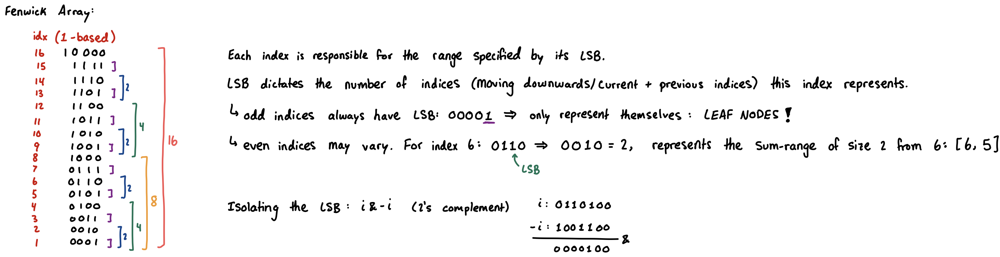
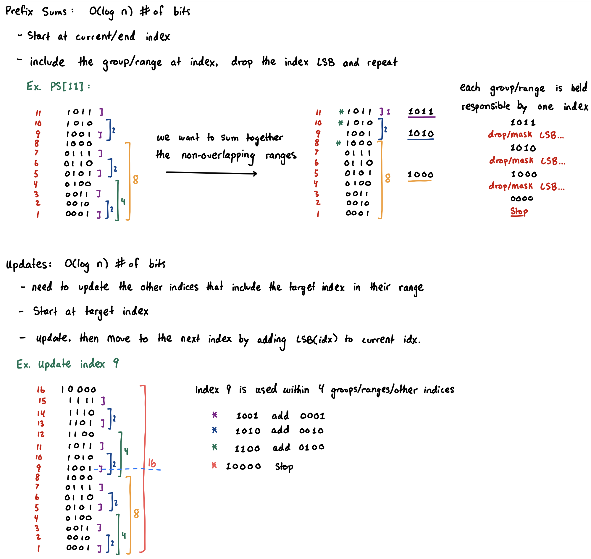

## Standard Fenwick Tree/BIT (Range Query and Point Update)

> **TL;DR:** fast and low-memory alternative to [segment tree](segment-tree.md) for point updates and prefix queries in $O(\log N)$ time. It strictly requires the operation to be invertible (like Sum or XOR) and must be 1-indexed.
> **NOTE:** in general, the ***recursive segment tree implementation*** is all you really need to know. It can solve anything, and thus fenwick tree isn't strictly useful if you already understand segment tree implementations. Though it is faster to write and is a shorter implementation.

- Each index is responsible for the range specified by its LSB.
  - LSB dictates the number of indices (moving downwards/current + previous indices) this index represents in its group.
  - Odd indicies have an LSB of 1, so they are leaf nodes, containing only themselves in their group
  - Even indices vary. `0110` will contain two indices within its group, itself, and the index below it: `[0110, 0101]`

* **Range queries** rely on computing **[prefix-sums](prefix-sum.md)** from the structure.
  - To compute range-sum, we simply compute the two relevant prefix sums.
* **Point updates** require updating all indicies that include the target index in their group.




```cpp
const int mxn = 2e5 + 5;
int n;
long long bit[mxn]; // 1-index BIT array
void update(int idx, long long val) {
  for (; idx <= n; idx += idx & -idx) bit[idx] += val;
}
long long prefix(int idx) {
  long long res = 0;
  for (; idx > 0; idx -= idx & -idx) res += bit[idx];
  return res;
}
long long query(int l, int r) { return prefix(r) - prefix(l-1); }
```

## Fenwick Tree (Range Updates)

- **Supporting range updates** involves the concept from [difference arrays](difference-array.md).
- If this was an offline problem, we could just use a raw difference array, perform the updates, and then compute the final array via a prefix-sum. If this is an online problem, where updates and queries are interleaved, we could use a modified Fenwick tree to drop the query time from $O(N)$ with prefix-sum to $O(log N)$ with BIT.

***If we only ever perform Point Queries***, we can slightly modify the implementation to now store a difference array in the underlying $A$ representation. Since we only allow point-queries in this, we can simply return the prefix sum of our difference array which will return the up-to-date target point: $A[\text{idx}]$.
```cpp
void update_range(int l, int r, long long val) {
  update(l, val);
  update(r+1, -val);
}
long long query(int idx) { return prefix(idx); }
```

***For BOTH Range Queries and Range Updates (see lazy segment tree)***, we need to use *two fenwick trees*.
- The reason we can't efficiently extend our original implementation, is because we switched to storing the difference arrays. Thus, when we would perform our query prefix-sum, it would yield the updated value for a single, specific, index: $A[\text{idx}]$. However, if we wanted the sum of $A[a..b]$, we would need to recompute the difference array summation up to $N$ times, which is too slow.
- We can improve this drastically:
  - Let $D$ be a difference array. Reconstructing $A$ from $D$ requires taking the prefix-sum, $A[i] = \sum_{j=1}^{i} D[j]$
    - $A[1] = D[1]$
    - $A[2] = D[1] + D[2]$
    - $A[3] = D[1] + D[2] + D[3]$
    - ...
  - To obtain the sum of $A[1..X]$, we need one more summation: $\sum_{i=1}^{X} A[i] = \sum_{i=1}^{X}\sum_{j=1}^{i} D[j]$.
    - $A[1] + A[2] + A[3] = (D[1]) + (D[1] + D[2]) + (D[1] + D[2] + D[3])$
  - This can be rewritten as:
    - $\sum_{i=1}^{X} D[i] \cdot (X - i + 1)$
    - $\sum_{i=1}^{X} (D[i] \cdot (X + 1) - D[i] \cdot i)$
    - $\sum_{i=1}^{X} D[i] \cdot (X + 1) - \sum_{i=1}^{X} D[i] \cdot i$
    - $(X + 1)\sum_{i=1}^X D[i] - \sum_{i=1}^{X}D[i] \cdot i$
- The ***first BIT*** will track $\sum D[i]$ and the ***second BIT*** will track $\sum D[i] \cdot i$
```cpp
const int mxn = 2e5 + 5;
int n;
long long bit1[mxn]; // tracks the difference array D[i]
long long bit2[mxn]; // tracks D[i] * i
void add(int idx, long long val) { // helper
  for (int i = idx; i <= n; i += i & -i) {
    bit1[i] += val;
    bit2[i] += val * idx;
  }
}
void update_range(int l, int r, long long val) {
  add(l, val);
  add(r + 1, -val);
}
long long prefix_range(int x) { // helper
  long long sum1 = 0, sum2 = 0;
  for (int i = x; i > 0; i -= i & -i) {
    sum1 += bit1[i];
    sum2 += bit2[i];
  }
  // return prefix_d1(x) * (x+1) - prefix_d2(x);
  return sum1 * (x + 1) - sum2; 
}
long long query_range(int l, int r) {
  return prefix_range(r) - prefix_range(l - 1);
}
```

### Resources
* intuition: https://www.youtube.com/watch?v=kPaJfAUwViY
* sample solutions and other implementations: https://codeforces.com/blog/entry/128045
