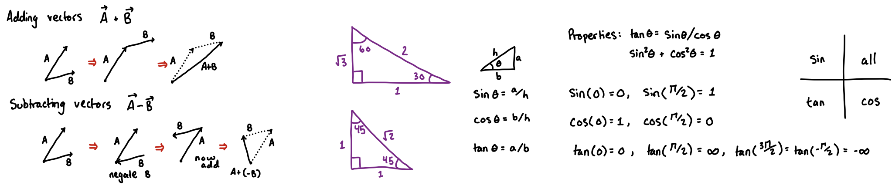
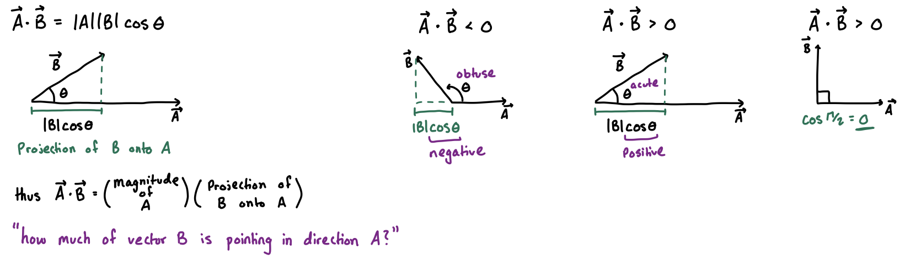
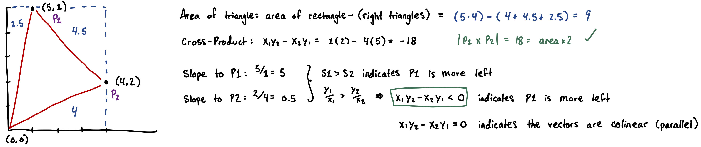
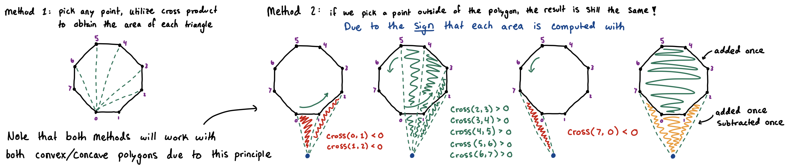
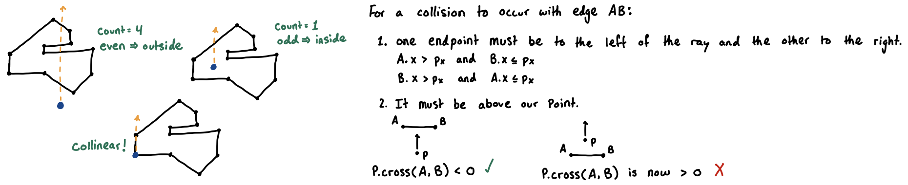

## Computational Geometry

> **TL;DR:** Solve geometric problems using 2D vectors and cross products. Try to **avoid floating-point math** by using cross products instead of angles or slopes. For distances it is common to store them as distance squared instead of taking the square-root.

**Terminology:** Often times we consider a point $p$ to act as a vector $\vec{r}$ directed from $0$ to $r$. This is a generalization and makes the most sense in most contexts, thus *point* and *vector* are often used interchangeably.



### 1. Dot Product
> Note that the dot (or scalar) product is not often necessary or used within algorithm implementations, but still reveals useful properties
- Let $P_1 = (x_1, y_1)$ and $P_2 = (x_2, y_2)$.
- **Algebriac Definition:** $P_1 \cdot P_2 = x_1 x_2 + y_1 y_2$
- **Geometric Definition:** $P_1 \cdot P_2 = |P_1| |P_2| \cos(\theta)$
  1. **Angle / Orthogonality:** the sign indicates the type of angle formed between the two vectors from the perspective of the reference point.
      - *Because the lengths ($|P_1|$ and $|P_2|$) are always positive, the sign of the result is entirely controlled by the cosine of the angle between them.*
      - If $P_1 \cdot P_2 = 0$, then the vectors are perfectly perpendicular (orthogonal, 90° angle).
      - If $P_1 \cdot P_2 > 0$, then the angle between them is acute (< 90°). This means they generally point in the same direction.
      - If $P_1 \cdot P_2 < 0$, then the angle between them is obtuse (> 90°). This means they generally point in opposite directions.



### 2. Cross Product

- Let $P_1 = (x_1, y_1)$ and $P_2 = (x_2, y_2)$.
- Using $(0,0)$ as the reference origin, the cross-product equation of vectors $\vec{P_1}$ and $\vec{P_2}$ is: $P_1 \times P_2 = x_1 y_2 - x_2 y_1$
  1. **Area:** the absolute value $|P_1 \times P_2|$ yields 2x the area of the triangle formed by $(0,0), P_1, P_2$.
  2. **Orientation:** the sign indicates which point ($P_1$ or $P_2$) is more left of the other from the perspective of the reference point.
      - *The interpretation of the sign comes from the slopes that each vector has, where a greater slope will be further left than a smaller slope (assuming the vectors are in the first quadrant... see image below)*
      - If $P_1 \times P_2 < 0$, then $P_1$ is more left from $P_2$
      - If $P_1 \times P_2 > 0$, then $P_1$ is more right from $P_2$
      - If $P_1 \times P_2 = 0$, then the two vectors are colinear (parallel)
- **Arbitrary Origins:** when considering a reference point that is not the origin, a cross product involves 3 points: $A$, $B$, and $C$. We treat point $A$ as the origin.
  - If $A$ is $(0,0)$, we know: $B \times C = B.x * C.y - C.x * B.y$
  - If $A$ is not $(0,0)$, we must normalize both $B$ and $C$ by subtracting $A$: $(B - A) \times (C - A)$
      - We can treat this normalize & cross computation as `A.triangle(B, C)`



### 3. Polygons

The **Shoelace Formula** can be used to compute the **area of a polygon**. The sweeping principle is the intuition behind why this formulation works with both concave and convex polygons. Because the cross product incorporates the rotational direction via the sign, different areas are cancelled out.



```cpp
long long polygon_area_doubled(const std::vector<Point>& poly) {
  long long area = 0;
  int n = poly.size();
#ifdef method1
  for (int i = 2; i < n; ++i) {
    area += poly[0].triangle(poly[i], poly[i-1]);
  }
#else
  for (int i = 0; i < n; ++i) {
    area += poly[i].cross(poly[(i+1) % n]);
  }
#endif
  return std::abs(area);
}
```

To determine if a **point is inside a polygon**, we utilize a similar concept described above (in terms of flipping parity); this time we are tracking the number of segments found in a path instead of area. This is called the **Even-Odd Rule**. If we shoot a ray in any direction and pass through an even number of edges, the point is outside of the polygon, otherwise the point is inside the polygon.



```cpp
bool is_inside_polygon(Point P, const std::vector<Point>& poly) {
  int n = (int)poly.size();
  bool inside = false;
  for (int i = 0; i < n; i++) {
    Point A = poly[i];
    Point B = poly[(i + 1) % n];
    if (P.triangle(A, B) == 0 &&
        std::min(A.x, B.x) <= P.x && P.x <= std::max(A.x, B.x) &&
        std::min(A.y, B.y) <= P.y && P.y <= std::max(A.y, B.y)) {
      return true; // point is on the boundary
    }
    bool a_left = (A.x <= P.x);
    bool b_left = (B.x <= P.x);
    if (a_left != b_left) {
      __int128 cross = P.triangle(A, B);
      if (a_left && cross < 0) inside = !inside;
      if (b_left && cross > 0) inside = !inside;
    }
  }
  return inside;
}
```

### 4. Convex Hull
- The convex hull is the smallest convex polygon enclosing a set of points: **snapping a rubber band around pegs**.
  1. Sort the points to be increasing in X-coordinate
  2. Start building the upper hull by moving left to right. If you ever face a point that will create a "left turn" (breaking the convex shape), we backtrack and remove the previous points until it makes a right turn again.
  3. Start building the lower hull by reversing the order of points so that we can move through the set right to left. Logic remains the same as in the upper hull construction.

```cpp
std::vector<Point> convex_hull(std::vector<Point> pts, bool keep_collinear = false) {
  std::sort(pts.begin(), pts.end());
  pts.erase(std::unique(pts.begin(), pts.end()), pts.end());
  int n = pts.size(), k = 0;
  if (n <= 2) return pts;
  std::vector<Point> hull(2 * n); // max hull size
  // first iteration is upper hull, second is lower hull (with reversed points)
  for (int rep = 0; rep < 2; ++rep) {
    // S prevents us from popping points that belong to the upper hull
    const int S = k;
    for (int i = 0; i < n; i++) {
      while (k >= S + 2) {
        __int128 v = hull[k-2].triangle(hull[k-1], pts[i]);
        if (v < 0 || (keep_collinear && v == 0)) break;
        k--;
      }
      hull[k++] = pts[i];
    }
    --k; // drop the last point because the second iteration will include it first
    std::reverse(pts.begin(), pts.end());
  }
  hull.resize(k);
  return hull;
}
```

### 5. Resources

* https://cp-algorithms.com/geometry/basic-geometry.html
* https://www.youtube.com/watch?v=G9QTjWtK_TQ
* https://www.youtube.com/watch?v=GPZ_WlwcEjI
