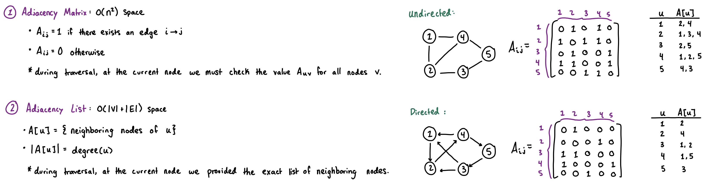
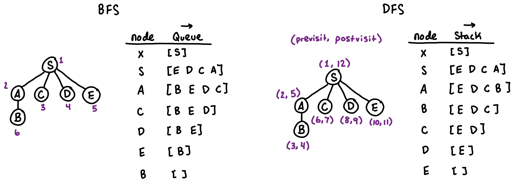
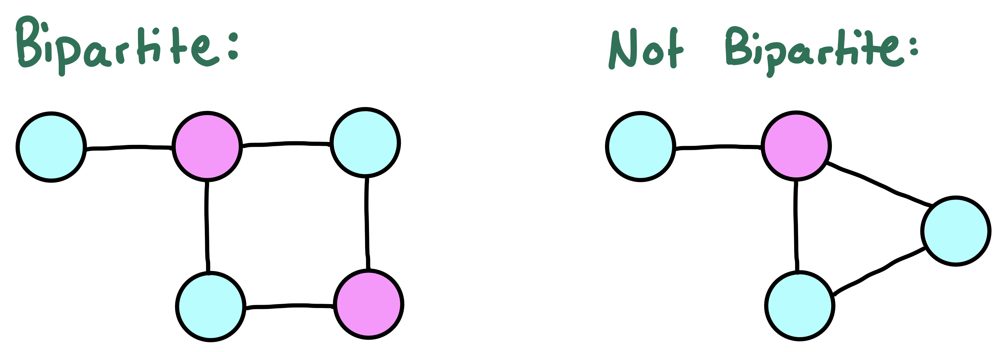
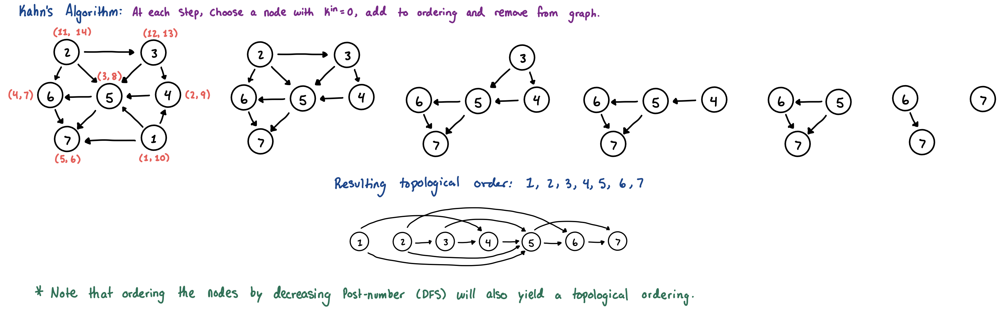

## Fundamental Terminology
* **Graph:** A mathematical structure composed of vertices (nodes) connected by edges, denoted as $G = (V, E)$.
    * $n$ standardly represents the number of vertices: $|V|$.
    * $m$ standardly represents the number of edges: $|E|$.
* **Edge Types:**
    * **Directed:** A one-way traversal from $U \to V$. The maximum number of edges is $n(n-1)$.
    * **Undirected:** A two-way traversal $U \leftrightarrow V$.
        * The maximum number of edges is $\binom{n}{2} = \frac{n(n-1)}{2}$.
        * A **Complete Graph** is one that has an edge between all pairs of nodes (maximum number of edges).
* **Degree:** The number of edges connected to a specific node.
    * In directed graphs, this is split into **in-degree** (number of incoming edges) and **out-degree** (number of outgoing edges).
* **Path:** A sequence of nodes in which every adjacent pair is connected by an edge.
    * **Simple Path:** A path that does not visit any node more than once (no cycle in the path).
    * **Cycle:** A path that starts and ends at the exact same node. In undirected graphs, a cycle must contain at least 3 distinct nodes (to avoid counting a trivial back-and-forth across a single edge).
* **Connectivity:**
    * **Connected Graph:** An undirected graph where a valid path exists between every single pair of nodes.
        * A directed graph can be considered connected if it is a connected while treating all edges as undirected.
    * **Strongly Connected:** A directed graph where a directed path exists between every pair of nodes in both directions.
        * All connected *undirected* graphs are strongly connected by nature.
    * **Component:** A maximal subgraph that is fully connected. If a graph is not connected, it is split into multiple distinct connected components.
* **Density:**
    * **Sparse Graph:** A graph where $m$ is relatively close to $n$ (e.g., $m \le 10^5$). Requires an Adjacency List.
    * **Dense Graph:** A graph where $m$ is close to $n^2$. Can sometimes be represented with an Adjacency Matrix.
* **Core Substructures:**
    * **Tree:** A connected, undirected graph with no cycles. A valid tree will always have exactly $n-1$ edges.
    * **DAG (Directed Acyclic Graph):** A directed graph with no directed cycles. Foundational for DP states.
    * **Bipartite Graph:** A graph whose vertices can be divided into two completely independent sets such that every edge strictly connects a vertex from the first set to the second. Bipartite graphs cannot contain any cycles of odd length.

## Graph Traversals
### Representation: Adjacency List
- While [adjacency matrices](matrices.md) are useful for dense graphs or path-counting, they require $O(V^2)$ memory. Generally since $V$ can be up to $2 \cdot 10^5$, we can't represent the graph as a matrix within the memory limits.
- In **Adjacency Lists**, we only store the edges that exist, using $O(V + E)$ memory.
  - `adj[u] = { nodes directly reachable from u }`
```cpp
const int mxn = 2e5 + 5;
std::vector<int> adj[mxn];                           // unweighted graph
std::vector<std::pair<int, int>> weighted_adj[mxn];  // weighted graph {v, w}

void add_undirected_edge(int u, int v) {
  adj[u].push_back(v);
  adj[v].push_back(u);
}
```



### DFS and BFS
- Most graph algorithms are some variation or combination of the basic dfs/bfs graph traversals. Both operate in $O(V + E)$ time.



**Depth-First Search (DFS):** dives deep as possibke along a branch before backtracking. Implemented using a stack (generally recursively using the call stack).
- **Best for:** Connectivity, cycle detection, tree traversals, and DP states.
- A common modification for acylic graphs is to simply provide the last node we came from in the parameters instead of keeping a visited array.
```cpp
bool seen[mxn];
void dfs(int u) {
  // previsit
  seen[u] = true;
  for (int v: adj[u]) {
    if (!seen[v]) {
      dfs(v);
    }
  }
  // postvisit
}
```

**Breadth-First Search (BFS):** explores neighbors level by level. Implemented using a queue.
- **Best for:** Finding the shortest path in an **unweighted** (or consistently weighted) graph.
  - The first time BFS reaches a node, it is guaranteed to be via the shortest path (# of steps).
```cpp
int dist[mxn];
void bfs(int start) {
  memset(dist, -1, sizeof(dist)); // -1 indicates unvisited
  dist[start] = 0;

  std::queue<int> q;
  q.push(start);
  while (!q.empty()) {
    int u = q.front();
    q.pop();
    for (int v: adj[u]) {
      if (dist[v] == -1) {
        dist[v] = dist[u] + 1;
        q.push(v);
      }
    }
  }
}
```

**0-1 BFS**
- Standard BFS only works when all edge weights are exactly the same. If edge weights can be either $0$ or $1$, standard BFS fails, and [Dijkstra's Algorithm](shortest-paths.md) ($O(E \log V)$) is unnecessarily slow.
- We can maintain the BFS shortest-path property by using a `std::deque` (double-ended queue). If we traverse an edge of weight $0$, we push the neighbor to the **front** of the queue (it should be processed immediately). If the weight is $1$, we push it to the **back** (processed in the next level).
  **Time Complexity:** $O(V + E)$.
```cpp
const int inf = 1e9;
int dist[mxn];
void zero_one_bfs(int start) {
  std::fill(dist, dist + mxn, inf);
  dist[start] = 0;

  std::deque<int> dq;
  dq.push_back(start);
  while (!dq.empty()) {
    int u = dq.front();
    dq.pop_front();
    for (auto [v, w]: weighted_adj[u]) {
      if (dist[u] + w < dist[v]) {
        dist[v] = dist[u] + w;
        if (w == 0) {
          dq.push_front(v);
        } else {
          dq.push_back(v);
        }
      }
    }
  }
}
```

### Bipartite Check (Graph Coloring)
A graph is bipartite if you can divide its vertices into two independent sets such that every edge connects a vertex in one set to a vertex in the other.



**Implementation:** Try to color the graph using two colors ($0$ and $1$). If you ever find an edge connecting two nodes of the same color, the graph contains an odd-length cycle and is therefore not bipartite.
```cpp
int color[mxn]; // -1 (uncolored)
bool is_bipartite(int start) {
  std::queue<int> q;
  color[start] = 0;
  q.push(start);
  while (!q.empty()) {
    int u = q.front();
    q.pop();
    for (int v: adj[u]) {
      if (color[v] == -1) {
        color[v] = 1 - color[u]; // flip color
        q.push(v);
      } else if (color[v] == color[u]) {
        return false;
      }
    }
  }
  return true;
}
```

### Cycle Detection
Detecting a cycle depends heavily on whether the graph is *undirected* or *directed*.

**Undirected Graphs:** ensure that the visited neighbor is not the immediate parent of the current node
```cpp
bool undirected_cycle(int u, int parent) {
  seen[u] = true;
  for (int v: adj[u]) {
    if (!seen[v]) {
      if (undirected_cycle(v, u)) return true;
    } else if (v != parent) {
      return true;
    }
  }
  return false;
}
```

**Directed Graphs:** finding a previously visited node does not guarantee a cycle (it might just be a cross-edge between branches).
* `0`: Unvisited
* `1`: Currently in the recursion stack (visiting)
* `2`: Fully processed (visited)

A cycle strictly exists **if and only if** we encounter a node with state `1`.
```cpp
int state[mxn];
bool directed_cycle(int u) {
  state[u] = 1; // Mark as currently visiting
  for (int v: adj[u]) {
    if (state[v] == 0) {
      if (directed_cycle(v)) return true;
    } else if (state[v] == 1) {
      return true; // Hit a node currently in the call stack (cycle)
    }
  }
  state[u] = 2; // Mark as fully processed
  return false;
}
```

### Directed Acyclic Graphs (DAGs) & Topological Sort
- A DAG is a directed graph with absolutely no cycles.
- Every valid [DP state-space](dynamic-programming.md) is a DAG. The dependencies between DP states form the directed edges.
    - Because there are no cycles, we can establish a **Topological Ordering**: a linear sequence of vertices such that for every directed edge $U \to V$, vertex $U$ appears before vertex $V$. This guarantees that when calculating DP states, all dependencies are resolved before computing the current state.

**DAG Properties:**
1. If $G$ has a topological order, then $G$ is a DAG.
2. If $G$ is a DAG, then $G$ has a topological order.

**Computing the Topological Order (*Linearizing a DAG*):**
- This algorithm is non-deterministic depending on the order that possible nodes are selected. There may be multiple topological orderings.



```cpp
int in_degree[mxn];
std::vector<int> topo_order;
bool topological_sort(int n) {
  std::queue<int> q;
  for (int i = 1; i <= n; ++i) {
    if (in_degree[i] == 0) q.push(i);
  }
  while (!q.empty()) {
    int u = q.front(); q.pop();
    topo_order.push_back(u);
    for (int v: adj[u]) {
      in_degree[v]--;
      if (in_degree[v] == 0) {
        q.push(v);
      }
    }
  }
  // if the topological order doesn't contain all nodes, the graph has a cycle
  return topo_order.size() == n; 
}
```
