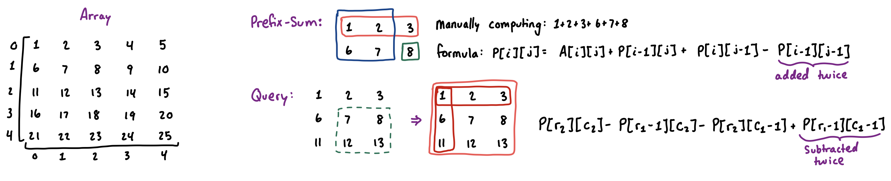

## Prefix Sums

> **TL;DR:** Prefix sums perform $O(1)$ range sum queries on **static arrays** (no updates), after $O(N)$ preprocessing.

### 1. 1D Prefix Sums (Range Queries)

* **Naive** loop takes $O(N)$ per query.
* We can **precalculate** the cumulative sum of the array from the start up to every index $i$.
  * If we know the sum of elements $A[0..3]$ and $A[0..6]$, then we can compute $A[4..6] = A[0..6]-A[0..3]$
  * This can be done for any range $[l, r]$ as: $A[l..r] = A[0..r] - A[0..l-1]$
      * Note that $l-1$ may go out of range for $l = 0$, thus it is common to use 1-based indexing, however it is not necessary.
      * Both `std::partial_sum()` and `std::adjacent_difference()` functions (for [difference arrays](difference-array.md)) use the 0-indexed partial sum.

| Index `i`          | 0   | 1   | 2   | 3   | 4   | 5   |
| ------------------ | --- | --- | --- | --- | --- | --- |
| **Array $A$**      | 0   | 3   | 1   | 4   | 1   | 5   |
| **Prefix-Sum $P$** | 0   | 3   | 4   | 8   | 9   | 14  |

```cpp
int n;
int a[n], p[n];

// std::partial_sum(a, a+n, p);
void preprocess() {
  for (int i = 0; i < n; ++i) {
    p[i] = (i > 0 ? p[i-1]: 0) + a[i];
  }
}
int query(int l, int r) { return p[r] - (l > 0 ? p[l-1]: 0); }
```

### 2. 2D Prefix Sums

* We want to find the sum of elements within a rectangle of a 2D grid.
* The prefix array $P[i][j]$ now represents the sum of elements in the rectangle $(0,0)$ to $(i,j)$.
  - Note that it is much cleaner to write this solution with one-based indexing to avoid extra out-of-bounds checks.
* We then utilize the (Inclusion-Exclusion principle)[combinatorics.md] for both construction and queries.



```cpp
int n, rows, cols;
int a[n][n], p[n][n];

void preprocess() {
  for (int i = 0; i < rows; ++i) {
    for (int j = 0; j < cols; ++j) {
      // p[i][j] = a[i][j] + p[i-1][j] + p[i][j-1] - p[i-1][j-1];
      p[i][j] = a[i][j] + (i>0 ? p[i-1][j]: 0) + (j>0 ? p[i][j-1]: 0) - (i>0&&j>0 ? p[i-1][j-1]: 0);
    }
  }
}

int query(int r1, int c1, int r2, int c2) {
  // return p[r2][c2] - p[r1-1][c2] - p[r2][c1-1] + p[r1-1][c1-1];
  return p[r2][c2] - (r1>0 ? p[r1-1][c2]: 0) (c1>0 ? p[r2][c1-1]: 0) (r1>0&&c1>0 ? p[r1-1][c1-1]: 0);
}
```
