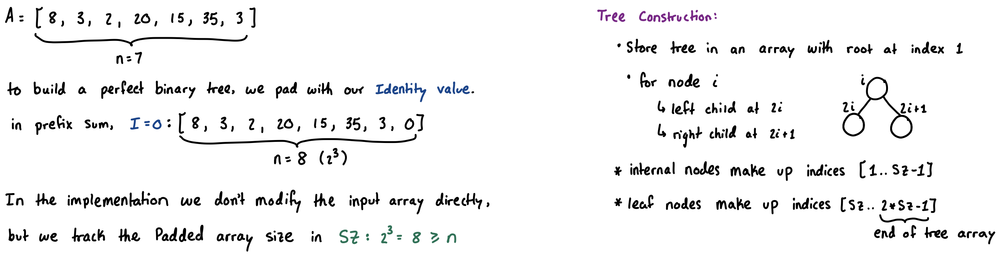
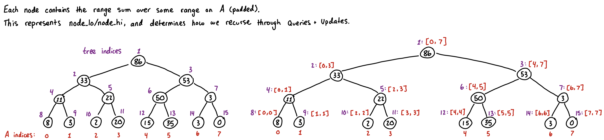
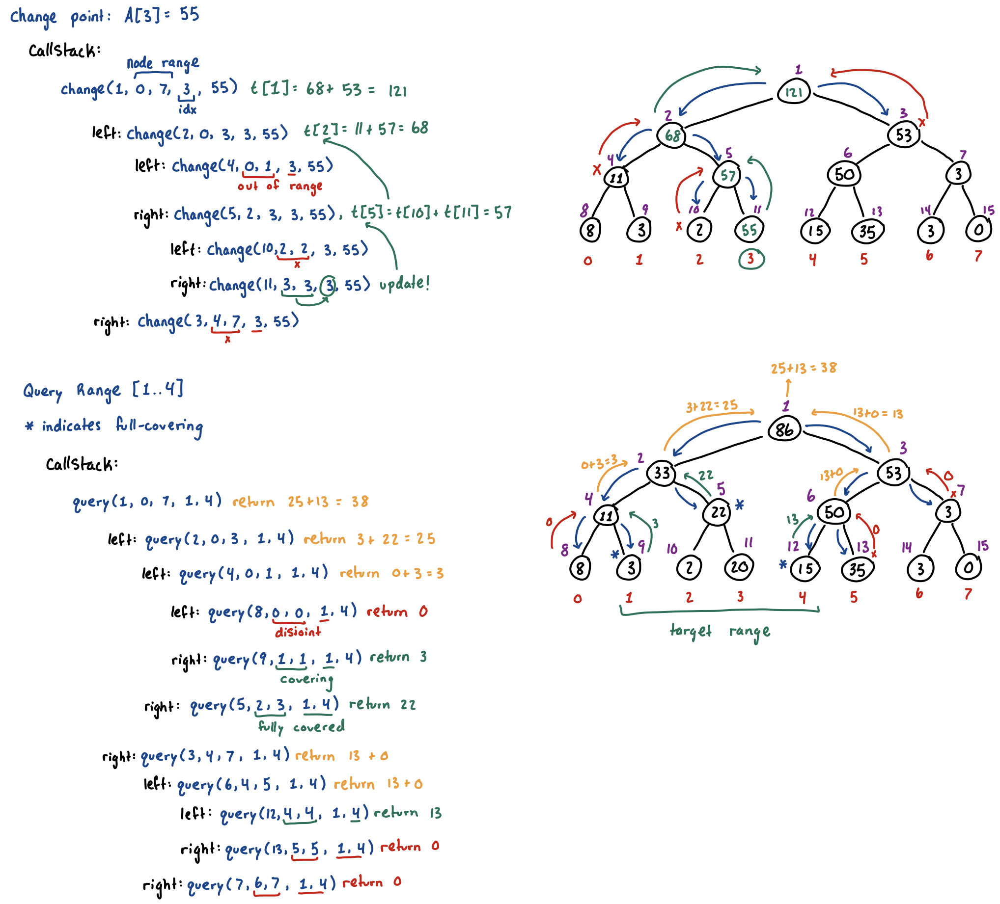

## Standard Segment Tree (Range Query and Point Update)

> **TL;DR:** Answers range queries (sum, min, max) and handles individual point updates, both in $O(\log N)$ time.

* Using a standard array allows point updates in $O(1)$ time and range queries in $O(N)$ time.
* Using a [prefix sum](prefix-sum.md) allows point updates in $O(N)$ time and range queries in $O(1)$ time.

- Segment trees can perform both operations in $O(\log N)$ time.
    - We can build a binary tree over the target array.
    - The root node stores the range-answer for the entire array $[0, N-1]$. The root's left child stores the left half, and the right child stores the right half, dividing recursively until the leaves store individual elements. 

* **Operations (query/update):**
  * When you **query a range**, we traverse through the tree and add together nodes that represent a range of values that are completely covered within the target range in the query. Sometimes this will mean using a leaf node, other times, it will be the internal nodes.
  * When you **update a single point**, you only need to update the specific leaf and then recalculate the $O(\log N)$ ancestor nodes directly above it on the path back to the root.

### Implementation

- The **tree size** must be at least 2 times the nearest power of 2 greater than `mxn`. Often times you will see `int tree[4 * mxn];` which is sufficient but sometimes extra memory.
- The **recursive** implementation is much more versitile and easier to work with when writing specific variations of a segment tree. The iterative implementation for `change()` as shown below is quicker to write.
- Using a **Node** struct with an overloaded `operator+` allows for easily "templating" the segment tree code to perform various different "combine" operations/calculations.
- **Identity (disjoint/padding/default) value:** you must return a value that does not affect the final answer. For sum, this is `0`. For finding the minimum, this should be `INF` (so it loses the `min()` comparison). For finding the maximum, it should be `-INF`.

*Example: Range Sum Query.*





```cpp
const int mxn = 2e5 + 5;
const int sz = (1 << 18); // 262,144 > mxn

int n;            // original array size
int a[mxn];       // original array
long long tree[sz * 2]; // root node at 1, leaf nodes start at tree[sz] (second half of array)

void build() {
  // for (int i = 0; i < n; ++i) change(1, 0, sz-1, i, a[i]);
  // Alternative: fill in leaf nodes [sz,2*sz-1] then parent nodes [1..sz-1]
  for (int i = 0; i < n; ++i) tree[sz + i] = a[i];
  for (int i = sz-1; i >= 1; --i) tree[i] = tree[2*i] + tree[2*i+1];
}
void change(int idx, long long val) { // iterative (much simpler to write)
  tree[sz + idx] = val; // update the leaf node
  for (int i = (sz+idx)/2; i >= 1; i /= 2) // update parents up the chain
    tree[i] = tree[2*i] + tree[2*i+1];
}
// change(1, 0, sz-1, idx:0-based, value)
void change(int node, int node_lo, int node_hi, int idx, long long val) {
  if (node_lo == idx && node_hi == idx) { // leaf node we want to change
    tree[node] = val;
    return;
  }
  if (node_lo > idx || node_hi < idx) return;
  int end_low = node_lo + (node_hi - node_lo) / 2;
  change(2 * node, node_lo, end_low, idx, val);
  change(2 * node + 1, end_low + 1, node_hi, idx, val);
  tree[node] = tree[2 * node] + tree[2 * node + 1];
}
long long query(int l, int r) { // iterative (much simpler to write)
  long long res = 0;
  for (l += sz, r += sz; l <= r; l /= 2, r /= 2) {
    if (l & 1) res += tree[l++]; // if l is a right child, its parent includes elements outside of our range [..l-1]
    if (!(r & 1)) res += tree[r--]; // if r is a left child, its parent includes elements outside our range [r+1..]
  }
  return res;
}
// query(1, 0, sz-1, l, r) --> note that lo and hi are all 0-based
long long query(int node, int node_lo, int node_hi, int l, int r) {
  if (l <= node_lo && node_hi <= r) return tree[node]; // full-covering
  if (node_lo > r || node_hi < l) return 0; // identity value for disjoint node
  int end_low = node_lo + (node_hi - node_lo) / 2;
  return query(2 * node, node_lo, end_low, l, r) +
         query(2 * node + 1, end_low + 1, node_hi, l, r);
}
```


## Segment Tree: Lazy Propagation (Range Query and Range Update)
> **TL;DR:** Upgrades the segment tree to apply updates to an entire range $[L, R]$ simultaneously in $O(\log N)$ time by deferring the workload until absolutely necessary. If we used a standard segment tree with point updates, it would take $O(N \log N)$ time.

* **Main idea:** traverse to a parent node that is fully-contained by the target range, apply the changes once to this parent node, and then *defer the changes for its children until necessary*.

- **Each node will contain:**
  1. Aggregate value: sum/min/max of its range.
  2. Lazy-tag: pending update (with some semantic effect) for its children.
  3. State flag: easily check if a lazy-tag is present.
- **Push Operation:** whenever we visit a node (while querying or updating), we must resolve any pending tags before interacting with its children.
  1. Apply tag's effects to left/right children.
  2. Accumulate the tag onto each child's existing lazy-tag(s).
  3. Clear current node's lazy-tag.

*Example: Range Addition Update, Range Sum Query.*

```cpp
const int mxn = 2e5 + 5;
const int sz = (1 << 18); // 262,144 > mxn

struct Node {
  long long sum, lazy;
  bool has_lazy;
  friend Node operator+(const Node& l, const Node& r) {
    return {l.sum + r.sum, 0, false};
  }
}

Node tree[sz * 2];

// how a lazy-tag affects a node
void apply(int node, int node_lo, int node_hi, long long lazy) {
  // for prefix-sum, adding lazy to each element increases total by lazy * count
  tree[node].sum += lazy * (node_hi-node_lo+1);
  tree[node].lazy += lazy; // accumulate tags for this child
  tree[node].has_lazy = true;
}
// push pending tags down to children
void push(int node, int node_lo, int node_hi) {
  if (!tree[node].has_lazy || node_lo == node_hi) return;
  int end_low = node_lo + (node_hi - node_lo) / 2;
  apply(2 * node, node_lo, end_low, tree[node].lazy);
  apply(2 * node + 1, end_low + 1, node_hi, tree[node].lazy);
  tree[node].lazy = 0;
  tree[node].has_lazy = false;
}
// add 'val' to each element within [l,r]
void update(int node, int node_lo, int node_hi, int l, int r, long long val) {
  if (l <= node_lo && node_hi <= r) {
    apply(node, node_lo, node_hi, val);
    return;
  }
  if (node_lo > r || node_hi < l) return;
  push(node, node_lo, node_hi);
  int end_low = node_lo + (node_hi - node_lo) / 2;
  update(2 * node, node_lo, end_low, l, r, val);
  update(2 * node + 1, end_low + 1, node_hi, l, r, val);
  tree[node] = tree[2 * node] + tree[2 * node + 1];
}
// query(1, 0, sz-1, l, r) --> note that lo and hi are all 0-based
Node query(int node, int node_lo, int node_hi, int l, int r) {
  if (l <= node_lo && node_hi <= r) {
    return tree[node]; // current node's sum
  }
  if (node_lo > r || node_hi < l) {
    return {0, 0, false}; // identity value for disjoint node
  }
  push(node, node_lo, node_hi);
  // new range that the next nodes will encompass
  int end_low = node_lo + (node_hi - node_lo) / 2;
  return query(2 * node, node_lo, end_low, l, r) +
         query(2 * node + 1, end_low + 1, node_hi, l, r);
}
```

### Resources
* segment tree intuition and implementation: https://www.youtube.com/watch?v=2FShdqn-Oz8
* lazy propagation: https://www.youtube.com/watch?v=Tr-xEGoByFQ&t=1021s
* sample solutions and other implementations: https://codeforces.com/blog/entry/128045
