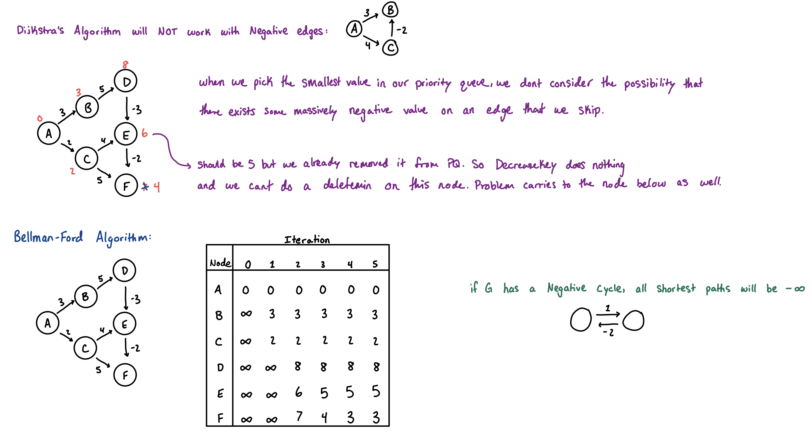

## Shortest Paths

BFS solves shortest paths for unweighted graphs, but **weighted graphs** require algorithms that can optimize paths based on *total cost rather than simply the number of edges*.

### Dijkstra's Algorithm
- Standard algorithm for finding the shortest path from a single source to all other nodes in a graph with **non-negative** edge weights.
- **This is a greedy algorithm:**
    - We maintain a set of nodes whose shortest distance from the source is already known.
    - At each step, we pick the unvisited node with the smallest known distance, finalize its distance, and "relax" (update) the distances to all its adjacent nodes.

* **Time Complexity:** $O(E \log V)$
* **Constraint:** Cannot handle negative edge weights.
```cpp
const int mxn = 2e5 + 5;
const long long inf = 1e18;

using pli = std::pair<long long, int>; // {v, weight}

std::vector<pli> adj[mxn];
long long dist[mxn];

void dijkstra(int start) {
  std::fill(dist, dist + mxn, inf);

  // min-heap stores pairs of {distance, node}
  std::priority_queue<pli, std::vector<pli>, std::greater<pli>> pq;

  dist[start] = 0;
  pq.emplace(0, start);
  while (!pq.empty()) {
    auto [d, u] = pq.top(); pq.pop();

    // optimization: ignore outdated distance pairs in the priority queue
    if (d > dist[u]) continue;

    for (auto [v, w] : adj[u]) {
      if (dist[u] + w < dist[v]) {
        dist[v] = dist[u] + w;
        pq.emplace(dist[v], v);
      }
    }
  }
}
```

**Multi-Source Dijkstra**
- When a problem asks for the shortest path from *any* of a set of starting nodes.
- Instead of running Dijkstra multiple times, we can initialize the algorithm by **pushing all starting nodes** into the priority queue with a distance of $0$.

### Bellman-Ford Algorithm
- Shortest path algorithm for graphs with **negative edge weights**.
    - Also detects negative weight cycles.
- **Intuition:**
    - The shortest path between any two nodes in a graph with $V$ vertices can contain at most $V-1$ edges (otherwise, it contains a cycle).
    - Bellman-Ford iteratively "relaxes" all edges in the graph $V-1$ times. By the end, the shortest paths are guaranteed to be found.
- **Algorithm:**
    - Obtain a list of all edges that exist in the graph.
    - Iterate through every edge ($U \to V, w$), $V$ times, adding $\text{dist}[V] = \text{dist}[U] + w$.
    - **Time Complexity:** $O(V \cdot E)$



**Negative Cycle Detection:** If we relax all edges one more time (the $V$-th iteration) and any distance still decreases, it strictly proves the existence of a negative weight cycle reachable from the source.
```cpp
struct Edge {
  int u, v;
  long long w;
};

std::vector<Edge> edges;
long long dist[mxn];

bool bellman_ford(int n, int start) {
  std::fill(dist, dist+n+1, inf);
  dist[start] = 0;

  // relax |V| - 1 times
  for (int i = 1; i < n; i++) {
    for (auto e: edges) {
      if (dist[e.u] != inf && dist[e.u] + e.w < dist[e.v]) {
        dist[e.v] = dist[e.u] + e.w;
      }
    }
  }

  // V-th relaxation to check for negative cycles
  for (auto e: edges) {
    if (dist[e.u] != inf && dist[e.u] + e.w < dist[e.v]) {
      return true;
    }
  }
  return false;
}
```

### Floyd-Warshall Algorithm
- Computes the shortest path between **all pairs** of nodes simultaneously.
- Handles negative weights (but **not negative cycles**).
- **Dynamic programming algorithm:**
  - Let $dist[i][j]$ be the shortest distance from $i$ to $j$.
  - Iterate through every possible intermediate node $k$.
    - If routing the path from $i \to k \to j$ is strictly shorter than the current known path from $i \to j$, we update it.

* **Time Complexity:** $O(V^3)$
* **Constraint:** Because of the $O(V^3)$ complexity, this is only viable for very small graphs ($V \le 400$).
* **Representation:** It naturally operates on an Adjacency Matrix rather than an Adjacency List.
```cpp
const int mxn = 405;
const long long inf = 1e18;

long long dist[mxn][mxn];
void floyd_warshall(int n) {
  // initialization:
  for (int i = 0 ; i < mxn; ++i) {
    for (int j = 0 ; j < mxn; ++j) {
      dist[i][j] = inf;
    }
  }
  for (int i = 1; i <= n; ++i) dist[i][i] = 0;
  for (int u = 1; u <= n; u++) {
    for (auto [v, w]: adj[u]) dist[u][v] = std::min(dist[u][v], w);
  }

  // dist[i][j] = weight of edge i->j (or inf if no edge exists)
  for (int k = 1; k <= n; ++k) {      // Intermediate node
    for (int i = 1; i <= n; ++i) {    // Source node
      for (int j = 1; j <= n; ++j) {  // Destination node
        if (dist[i][k] != inf && dist[k][j] != inf) {
          dist[i][j] = std::min(dist[i][j], dist[i][k] + dist[k][j]);
        }
      }
    }
  }
}
```
