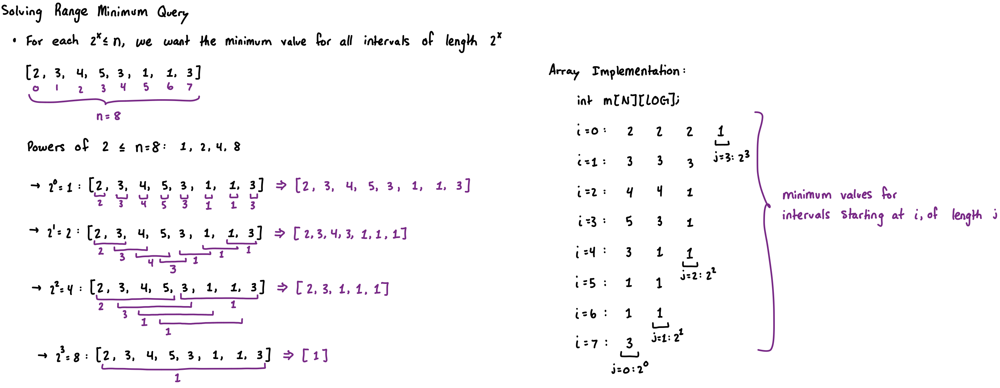
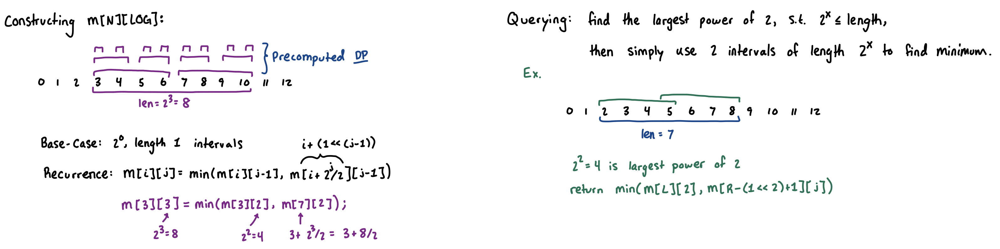

## Sparse Table (Static Array, Range Query)

> **TL;DR:** Answers range queries on **static** arrays (no updates). For idempotent operations (like `min`, `max`, `gcd`), it answers queries in $O(1)$ time after an $O(N \log N)$ build phase.

* An **idempotent** operation is one that can be repeated to the same element multiple times without ever producing a different result ($\min(x,x) = x$).

* Just like with [binary lifting](binary-lifting.md), we only do things in powers of 2. Our structure is very similar as well: `int m[N][LOG]`.
* For each power of 2, such that $2^x <= N$, we want to store the minimum/maximum value for all intervals on $A$, of size $2^x$.



* We can perform preprocessing to compute this 2d array.
* Since any number can be represented as a sum of powers of two (binary), we can use dynamic programming to utilize the smaller intervals that have already been computed, to compute the min/max values of larger intervals.



```cpp
const int N = 1e5+5;
const int LOG = 17;
int n;
int a[N];
int m[N][LOG];

void build() { // O(N*log(N))
  for (int i = 0; i < n; ++i) m[i][0] = a[i];
  for (int k = 1; k < LOG; ++k) {
    int d = (1 << k); // distance of interval
    for (int i = 0; i+d-1 < n; ++i) {
      m[i][k] = std::min(m[i][k-1], m[i+d/2][k-1]);
    }
  }
}
int query(int l, int r) { // O(1) ignoring max-log computation
  int len = r-l+1;
  int k = 0;
  while((1 << (k+1)) <= len) ++k;
  // int k = 31 - __builtin_clz(len); // unecessary trick
  return std::min(m[l][k], m[r-(1<<k)+1][k]);
}
```

### Resources
* https://www.youtube.com/watch?v=0jWeUdxrGm4
