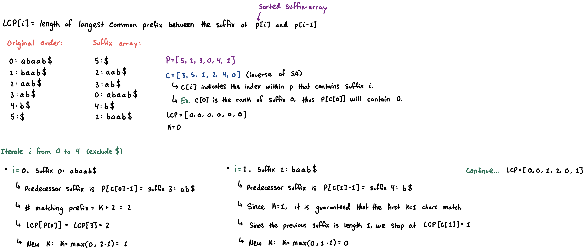

## Suffix Array & LCP Array

> **TL;DR:** Lexicographically sorts all suffixes of a string in $O(N \log N)$ time. When paired with the Longest Common Prefix (LCP) array it can solve problems such as distinct substrings, longest repeated substrings, and others that **[standard hashing](polynomial-rolling-hash.md) cannot handle.**

### 1. Suffix Array

* This is a space-efficient alternative to a *suffix tree*, which is a compressed version of a *trie*. Thus, suffix arrays can do everything that a suffix tree can.
* A **suffix array** will contain integers that represent the **starting indexes** of all the suffixes of a given string, in *sorted order*.
    - This provides a compressed representation of the ordered suffixes without storing them explicitly.

- For a given string `"camel"` we have the following suffixes along with an associated start-index:
    - `"camel": 0`
    - `"amel": 1`
    - `"mel": 2`
    - `"el": 3`
    - `"l": 4`
- After *sorting* the set of suffixes lexicographically, we can obtain the **suffix array** of `[1, 0, 3, 4, 2]`:
    - `"amel": 1`
    - `"camel": 0`
    - `"el": 3`
    - `"l": 4`
    - `"mel": 2`

- **Constructing the suffix-array:**
    - Performing string sorting takes $O(N^2 \log N)$ time due to $O(N)$ for each string comparison.
    - Instead, we can achieve an $O(N \log N)$ construction with the **Prefix Doubling** algorithm.

### Prefix Doubling Algorithm

**Setup: Sentinel Character**
- First, we append `$` to the end of the input string. This must be an arbitrary character that is lexicographically smaller than all characters in the alphabet. Necessary for two reasons:
    - **Prefix Tie-Breaking:** If one suffix is a prefix of another (`"ab"` vs `"aba"`), the shorter one strictly sorts first because it hits the `$` before the other finishes.
    - **Cyclic Shifts to Suffixes:** This algorithm actually sorts *cyclic shifts* (rotations). The `$` ensures that the sorted order of these cyclic shifts perfectly matches the true suffix order. 
- **Example: `"aba"` $\to$ `"aba$"`**

| Index | Initial Cyclic Shift |       | Sorted Shift | Original Index |
|:----- |:-------------------- |:----- |:------------ |:-------------- |
| 0     | `"aba$"`             |       | `"$aba"`     | 3              |
| 1     | `"ba$a"`             |       | `"a$ab"`     | 2              |
| 2     | `"a$ab"`             |       | `"aba$"`     | 0              |
| 3     | `"$aba"`             |       | `"ba$a"`     | 1              |

> **Note:** Without the `$`, the shift `"aab"` would have incorrectly sorted to the very top.

**Implementation:**
1. **Input string:** `"abaab"` $\to$ `"abaab$"`.
2. **Equivalence Classes & Plan:**
    - We will iteratively sort prefixes of length $2^k$, doubling the comparison length in each phase.
        - Because a string of length $2^k$ splits perfectly into two length-$2^{k-1}$ halves, we can represent the rank of the larger string as the pair of two ranks computed in the previous phase.
        - After $2^k \ge N$, we have identified the lexicographic order of all cyclic shifts based on $n$ characters. Return $P$.
    - After sorting each prefix of a given length, we classify distinct prefixes by their lexicographic order as their **rank**.
        - Equivalent prefixes are a part of the same **equivalence class** and are given the same rank.
    - **Class Array:** $C[s]$ is the sorted prefix-rank for suffix $s$ (starting index).
    - **Suffix Array:** $P[i]$ is the suffix (starting index) that is in the $i$'th sorted position for the current phase.
3. **Sorting**
    - **Phase 1:**
        - Sort each suffix by length 1 (`s[0]` of each suffix).
            - This is acceptable because sorting will be $O(N \log N)$ with `std::sort`, and $O(N)$ with **counting sort & radix sort**.
        - Each prefix is given a *rank* based on *sorted order*.
        - Then each suffix is classified by the rank of its prefix.
        - $C_1 = [1, 2, 1, 1, 2, 0]$
    - **Phase 2:**
        - The prefix-rank for each prefix of length 2 can be described by the combination of two prefix-ranks of size 1.
            - For the suffix starting at index 0: `"abaab$"`, we know that $C_1[0]$ describes the rank of `"a"`.
            - For the suffix starting at index 1: `" baab$"`, we know that $C_1[1]$ describes the rank of `"b"`.
            - To describe the first prefix-rank of size 2: `"ab"`, we can simply pair the ranks that we already computed: $(C_1[0], C_1[1])$.
        - To generalize this, the "paired"-prefix-rank of size 2 for each suffix $i$ will be: $(C_1[i], C_1[(i+1)\%n])$.
        - We can then perform a sort on these ranks and identify the new suffix classes to store in $C_2$.
            - Note that in the implementation we simply re-use the same $C$ array.
    - **Phase 3:**
        - Continuing in powers of 2, the prefix-rank for each prefix of length 4 can be made up of two prefix-ranks of size 2.
        - For each suffix $i$, the prefix-rank of size 4 will be $(C_2[i], C_2[(i+2)\%n])$
            - Note that it is $i+2$ for the second half, because we want the prefix-rank of `"abaab$"` and `"  aab$"`, to construct the rank for `"abaa"`. If we used $i+1$ we would be constructing `"aba"`.
        - For each phase $k$, sorting by prefix-ranks for each prefix of length $2^k$, will be: $(C_{k-1}[i], C_{k-1}[(i + 2^{k-1})\%n])$

**Sorting Algorithm for Rank-Pairs**
- We could simply use `std::sort`, however merge-sort is a comparison based sorting algorithm that takes $O(N \log N)$ time. This means that our suffix array construction will be $ON \log^2 N)$ time.
- By using **[Counting Sort and Radix Sort](sorting.md)** on these pairs, we can sort each phase in $O(N)$ time. Since there are $\log N$ phases, the total time to sort all suffixes is $O(N \log N)$.
    - Note that in the implentation of *radix sort*, we are able to skip the first pass of stable counting sort. This is because the right half of a given "paired"-prefix-rank is already in sorted order due to how we construct the pairs from the $C$ computed in the previous phase.


> **Note:** I have found that the intuition to the algorithm described above is easy to digest, however the specific implementation details can get very confusing due to the deep levels of nested array indexing, different variables/arrays, etc. The following sample walkthrough describes the algorithm as it is being computed for a sample string.

[suffix-example.pdf](attachments/suffix-example.pdf)


### 2. The LCP Array & Kasai's Algorithm ($O(N)$)
* The Suffix Array alone is just a sorted list of indices. Paired with the **LCP (Longest Common Prefix) Array**, we can perform real computations.
* `LCP[i]` stores the **length of the longest common prefix between the $i$-th suffix and the $(i-1)$-th suffix in the Suffix Array.**

- **Kasai's Algorithm:** Computes the LCP array in $O(N)$ time.
    - Iterate through the suffixes in their *original* string order.
    - If the LCP of the current suffix and its sorted-neighbor is $K$, then the LCP of the *next* suffix (which drops the first character) and its sorted-neighbor must be at least $K - 1$.



### Applications
1. **Number of Distinct Substrings:** A string of length $N$ has $\frac{N(N+1)}{2}$ total substrings.
    * When looking at the sorted suffixes, any common prefix between adjacent suffixes represents a substring we have already counted.
    * Total Distinct = $\frac{N(N+1)}{2} - \sum_{i=1}^{N} LCP[i]$.
2. **Longest Repeated Substring:**
    * It is simply the maximum value in the LCP array: `std::max_element(lcp.begin(), lcp.end())`.
3. **Longest Common Substring of Two Strings:**
    * Concatenate them with a unique separator: $S_1 + \text{'\#'} + S_2 + \text{'\$'}$.
    * Build the SA and LCP. Find the maximum $LCP[i]$ where the $i$-th suffix and $(i-1)$-th suffix originate from *different* original strings.


### Implementation
```cpp
struct SuffixArray {
  int n;
  std::vector<int> p, c, lcp;
  SuffixArray(std::string s) {
    s += '$';
    n = (int)s.size();

    int k = std::max(256, n);
    p.assign(n, 0);
    c.assign(n, 0);
    std::vector<int> cnt(k, 0);

    // sort single characters
    for (int i = 0; i < n; i++) cnt[s[i]]++;
    for (int i = 1; i < k; i++) cnt[i] += cnt[i - 1];
    for (int i = 0; i < n; i++) p[--cnt[s[i]]] = i;

    c[p[0]] = 0;
    int rank = 1;
    for (int i = 1; i < n; i++) {
      if (s[p[i]] != s[p[i-1]]) rank++;
      c[p[i]] = rank - 1;
    }

    // radix sort for powers of 2
    std::vector<int> pn(n), cn(n);
    for (int h = 0; (1 << h) < n; ++h) {
      // Right Half: p is already sorted by the right-half rank.
      // We identify the starting indices of the left-halves by shifting back 2^h.
      for (int i = 0; i < n; i++) {
        pn[i] = (p[i]-(1<<h) + n) % n;
      }

      // Left Half: Stable counting sort on the left-half prefix-ranks
      for (int i = 0; i < rank; i++) cnt[i] = 0;
      for (int i = 0; i < n; i++) cnt[c[pn[i]]]++;
      for (int i = 1; i < rank; i++) cnt[i] += cnt[i - 1];

      // insert in reverse order of partially sorted pairs (stable counting sort)
      for (int i = n - 1; i >= 0; i--) p[--cnt[c[pn[i]]]] = pn[i];

      // recompute the next equivalence class array (new prefix-ranks)
      cn[p[0]] = 0;
      rank = 1;
      for (int i = 1; i < n; i++) {
        std::pair<int, int> cur = {c[p[i]], c[(p[i] + (1 << h)) % n]};
        std::pair<int, int> prev = {c[p[i-1]], c[(p[i-1] + (1 << h)) % n]};
        if (cur != prev) ++rank;
        cn[p[i]] = rank - 1;
      }
      c.swap(cn);
    }
    build_lcp(s);
  }

  // Kasai's Algorithm: O(N)
  void build_lcp(const std::string& s) {
    lcp.assign(n, 0);
    int k = 0;
    for (int i = 0; i < n - 1; i++) {
      int pi = c[i]; // rank of suffix i
      int j = p[pi - 1]; // the suffix just before it in the sorted array
      while (s[i + k] == s[j + k]) k++;
      lcp[pi] = k;
      k = std::max(0, k - 1); // LCP of next suffix is at least k - 1
    }
  }
};
```

### Resources
* Implementation: https://cp-algorithms.com/string/suffix-array.html
* Suffix array intuition: https://www.youtube.com/watch?v=zqKlL3ZpTqs&list=PLDV1Zeh2NRsCQ_Educ7GCNs3mvzpXhHW5&index=1&t=3s
* LCP: https://www.youtube.com/watch?v=53VIWj8ksyI&list=PLDV1Zeh2NRsCQ_Educ7GCNs3mvzpXhHW5&index=3
