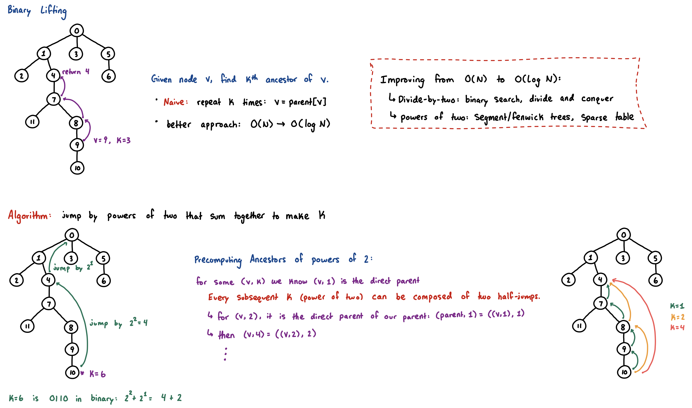

## Trees

A tree is a connected, undirected graph with no cycles. **This definition guarantees the following properties:**
1. A tree always has exactly $n - 1$ edges.
2. There is exactly **one** simple path between any two nodes.
    - Since this is the only path, it is also the shortest.
3. Adding any single edge to a tree will create exactly one cycle.

### Tree Traversals
Because trees have no cycles, we do not need a boolean `seen` array to prevent infinite loops during a DFS. We only need to know which node we just came from (the `parent`) to avoid walking directly backward.
- We can easily precompute structural properties like `depth` and `subtree_size` for every node.
```cpp
const int mxn = 2e5 + 5;
std::vector<int> adj[mxn];

int depth[mxn];
int subtree_size[mxn];

void dfs(int u, int parent) {
  subtree_size[u] = 1;
  for (int v: adj[u]) {
    if (v != parent) {
      depth[v] = depth[u] + 1;
      dfs(v, u);
      subtree_size[u] += subtree_size[v]; // add child's subtree size after it returns
    }
  }
}
```

### Tree Diameter
The diameter of a tree is the length of the longest path between any two nodes.
- **Intuition:**
    - Pick any arbitrary starting node and find the furthest node from it (let's call it $A$).
    - Node $A$ is mathematically guaranteed to be one of the endpoints of the diameter.
    - Then, find the furthest node from $A$ (let's call it $B$). The path from $A$ to $B$ is the diameter.
- This can be performed in two DFS traversals:
```cpp
int max_dist = -1;
int far_node = -1;
void dfs_dist(int u, int parent, int d) {
  if (d > max_dist) {
    max_dist = d;
    far_node = u;
  }
  for (int v : adj[u]) {
    if (v != parent) {
      dfs_dist(v, u, d + 1);
    }
  }
}

// Usage:
// max_dist = -1; dfs_dist(1, 0, 0);
// max_dist = -1; dfs_dist(far_node, 0, 0);
// max_dist now strictly holds the diameter.
```

### Minimum Spanning Tree (MST)
A Minimum Spanning Tree is a subset of edges in a weighted, undirected graph that connects all vertices with the minimum possible total edge weight, forming a tree.

**Kruskal's Algorithm:**
- Sort all edges in the graph from lightest to heaviest.
- Iterate through them:
    - If an edge connects two nodes that are already in the same component, adding it would create a cycle, so discard it.
    - If they are in different components, add the edge to the MST and merge the components using DSU.

* **Dependencies:** Requires a standard [DSU implementation](disjoint-set-union.md).
* **Time Complexity:** $O(E \log E)$ due to sorting the edges.

[kruskal-walkthrough.pdf](attachments/kruskals-walkthrough.pdf)


```cpp
struct Edge {
  int u, v;
  long long w;
  bool operator<(const Edge& other) const {
    return w < other.w;
  }
};

long long kruskal(int n, std::vector<Edge>& edges) {
  std::sort(edges.begin(), edges.end());
  DSU dsu(n);

  long long mst_weight = 0;
  int edges_used = 0;
  for (auto e: edges) {
    if (dsu.unite(e.u, e.v)) {
      mst_weight += e.w;
      edges_used++;
      if (edges_used == n - 1) break; // MST is complete
    }
  }
  // if edges_used < n - 1, the graph is disconnected and an MST is impossible.
  return mst_weight;
}
```

### Binary Lifting & Lowest Common Ancestor

Question: Given node $v$ and integer $k$, find the $k$-th ancestor of $v$ in the tree $T$.
- A naive implementation simply performs an $O(k)$ search.
- We can improve this using powers of 2, much like [segment trees](segment-tree.md), [fenwick trees](fenwick-tree.md), or [sparse tables](sparse-table.md).



**Implementation:**
- Precompute `up[u][j]`, representing the $2^j$-th ancestor of node $u$.
    - This is often computed with a dfs to also initialize a depth array that is used for **lowest common ancestor (LCA)**.
```cpp
const int LOG = 20;
int depth[mxn];
int up[mxn][LOG];

void dfs_init(int u, int p) {
  up[u][0] = p;
  for (int v: adj[u]) {
    if (v != p) {
      depth[v] = depth[u] + 1;
      dfs_init(v, u);
    }
  }
}

void build_lifting(int n, int root) {
  depth[root] = 0;
  dfs(root, 0);

  for (int j = 1; j < LOG; j++) {
    for (int i = 1; i <= n; i++) {
      up[i][j] = up[up[i][j - 1]][j - 1];
    }
  }
}

int kth_ancestor(int node, int k) {
  for (int j = 0; j < LOG; j++) {
    if (k & (1LL << j)) {
      node = up[node][j];
    }
  }
  return node;
}
```

**Lowest Common Ancestor:**
- The **LCA** of two nodes $u$ and $v$ is the deepest node in the tree that is an ancestor to both. Finding the LCA allows us to compute the exact distance between any two nodes in $O(\log N)$ time using the formula: $\text{dist}(u, v) = \text{depth}[u] + \text{depth}[v] - 2 \cdot \text{depth}[\text{lca}(u, v)]$
- **LCA Algorithm:**
    1. Implement binary lifting structure.
    2. Given $u$ and $v$, if they are at different depths, lift the deeper node until their depths are exactly equal.
    3. If they are the same node, we are done.
    4. Otherwise, lift both $u$ and $v$ together in tandem, taking the largest possible power-of-2 jumps that **do not** land on the same node (which ensures we stop immediately *below* the LCA).
    5. Return the immediate parent of where they land.

**Time Complexity:** $O(N \log N)$ preprocessing, $O(\log N)$ per query.

```cpp
int get_lca(int a, int b) {
  if (depth[a] < depth[b]) std::swap(a, b);
  int diff = depth[a] - depth[b];
  // lift a to same depth as b
  a = kth_ancestor(a, diff);

  if (a == b) return a;

  // lift both until their parents are equal
  for (int i = LOG - 1; i >= 0; i--) {
    if (up[a][i] != up[b][i]) {
      a = up[a][i];
      b = up[b][i];
    }
  }
  return up[a][0];
}

int tree_distance(int a, int b) {
  int lca = get_lca(a, b);
  return depth[a] + depth[b] - 2 * depth[lca];
}
```

### Resources
- binary lifting: https://www.youtube.com/watch?v=oib-XsjFa-M
- LCA: https://www.youtube.com/watch?v=dOAxrhAUIhA&t=1s
