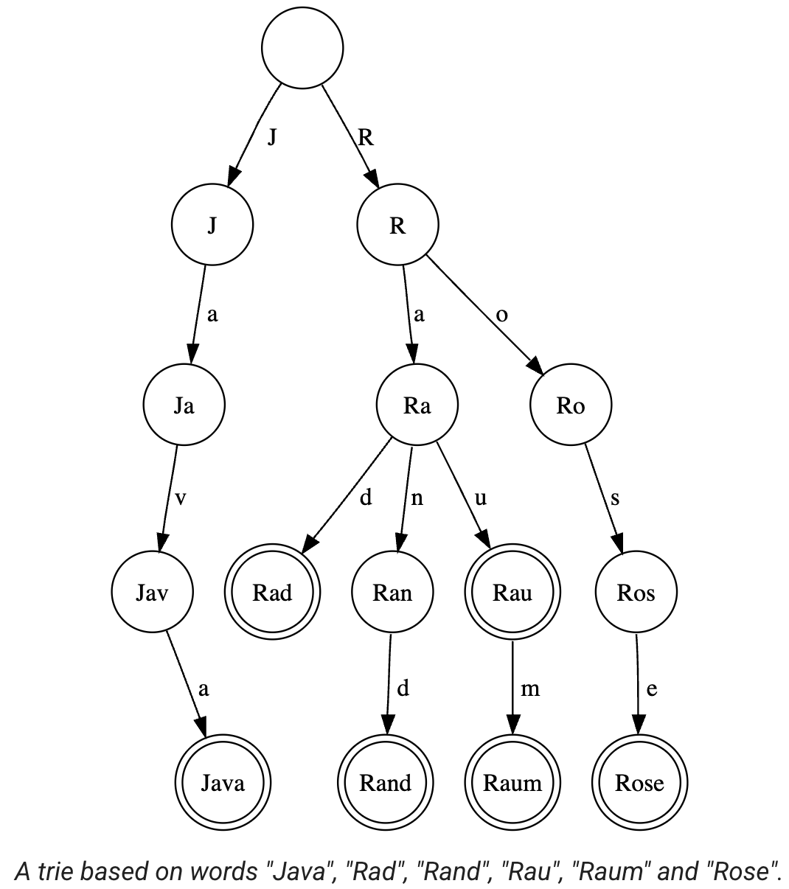

## Standard Trie (Prefix Tree)

> **TL;DR:** tree-based data structure for string manipulation and prefix matching. Insertion and searches take $O(N)$ time (length of string).

* The structure starts with an empty `root` node.
* Edges (array indices) represent characters. Nodes simply represent a state or the end of a path.
* If multiple strings share the same prefix, they share the exact same nodes in the tree up until they diverge.
* Each node requires a boolean flag (`is_end`) to mark whether a valid string terminates at that specific node.

**Example:** `"app"`, `"apple"`, `"bat"`:
```text
            (root)
            /    \
         'a'      'b'
         /          \
       'p'          'a'
       /              \
    (end)'p'          't'(end)
     /
   'l'
   /
(end)'e'
```
*Notice how `"app"` ends on the second 'p', which is marked as an `end` node, but the path continues downward to finish `"apple"`.*

**A trie can also be interpretted as a finite state automaton:**




### Array-based Implementation

```cpp
// mxNodes must be >= the sum of the lengths of all strings inserted
const int mxNodes = 1e5 + 5;
int tree[mxNodes][26];
bool is_end[mxNodes];
int cnt = 0; // next available unused node index

void insert(const std::string& s) {
  int u = 0; // root
  for (char c: s) {
    int v = c - 'a';
    if (!tree[u][v]) tree[u][v] = ++cnt; // Dispense a new node if path is empty
    u = tree[u][v];
  }
  is_end[u] = true;
}

bool search(const std::string& s) {
  int u = 0;
  for (char c: s) {
    int v = c - 'a';
    if (!tree[u][v]) return false;
    u = tree[u][v];
  }
  return is_end[u];
}
```

### Struct-based Implementation

See the template: [trie.cpp](../templates/code/trie.cpp)

### Resources
* image from: https://cp-algorithms.com/string/aho_corasick.html
    * "The image by [nd](https://de.wikipedia.org/wiki/Benutzer:Nd) is distributed under CC BY-SA 3.0 license."
